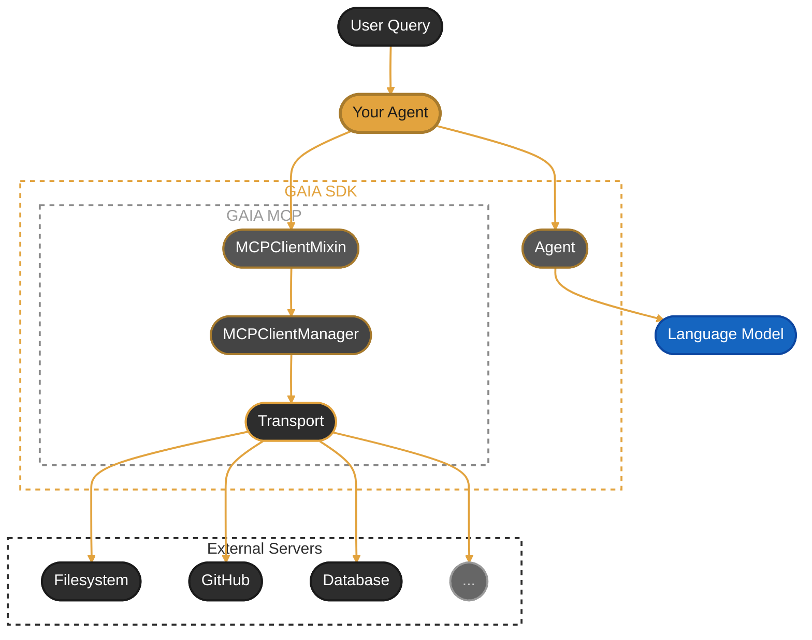

<Warning>
  **CLI update (#977):** `gaia mcp add` and `gaia mcp remove` have been removed.
  Configure MCP servers by editing `~/.gaia/mcp_servers.json` directly (shown below),
  or, for catalog connectors, with `gaia connectors configure <id> --set KEY=VALUE`
  (secrets are stored in the OS keyring). `gaia mcp list`, `gaia mcp tools`, and
  `gaia mcp test-client` still work. Run `gaia connectors --help` for connector usage;
  see issue #1339 for the ongoing connectors migration.
</Warning>

**Connect your GAIA agent to any tool ecosystem with a single line of code.**

- 🔌 **Universal tool integration** - Filesystem, GitHub, databases, and hundreds more
- ⚡ **Zero code required** - Configure once, tools auto-register
- 🌍 **Industry standard** - Built on [Model Context Protocol](https://modelcontextprotocol.io/)
- 🔍 **Auto-discovery** - Tools document themselves to your agent

<Info>
  **Examples:**
  - [`examples/mcp_time_server_agent.py`](https://github.com/amd/gaia/blob/main/examples/mcp_time_server_agent.py) - Simple Python server example
  - [`examples/mcp_config_based_agent.py`](https://github.com/amd/gaia/blob/main/examples/mcp_config_based_agent.py) - Config file-based loading
  - [`examples/mcp_windows_system_health_agent.py`](https://github.com/amd/gaia/blob/main/examples/mcp_windows_system_health_agent.py) - System analysis with Windows-MCP
</Info>

<Note>
**See Also:**
- [SDK Reference](/sdk/sdks/mcp) - Quick code snippets
- [Full Specification](/spec/mcp-client) - Complete API documentation and implementation details
</Note>

## What is MCP?

### The Problem

Building AI agents that interact with external tools is hard. Every service has its own API, authentication method, and data format. Want your agent to read files, create GitHub issues, AND query a database? That's three separate integrations to build and maintain.

### The Solution

**MCP (Model Context Protocol)** is like USB for AI - a universal connector that lets any AI application talk to any tool. Just as USB eliminated the need for custom cables, MCP eliminates the need for custom integrations.

```
Before MCP:  Agent → Custom Code → GitHub API
             Agent → Custom Code → Filesystem API
             Agent → Custom Code → Database API

With MCP:    Agent → MCP → Any Tool
```

<Tip>
**Learn More:** MCP is an open standard created by Anthropic. Visit [modelcontextprotocol.io](https://modelcontextprotocol.io/) for the full specification and ecosystem.
</Tip>

### How GAIA Uses MCP

GAIA agents act as **MCP clients** that connect to **MCP servers**. Each server exposes tools (like "read_file" or "create_issue") that your agent can call. The protocol handles all the communication details - you just connect and use the tools.

## See It In Action

Try it now - this connects to an MCP server and starts an interactive session:

```bash
uv run examples/mcp_config_based_agent.py
```

```
Connected to MCP servers: time
Try: 'What time is it in Tokyo?' | Type 'quit' to exit.

You: What time is it in Tokyo?

Agent: The current time in Tokyo is 11:59 PM on Wednesday, January 28, 2026, Japan Standard Time (JST).
```

MCP server connected, tools auto-discovered, and the agent uses them naturally.

## Quick Start

<Steps>
  <Step title="Initialize MCP configuration">
    ```bash
    gaia init --profile mcp
    ```
    This creates `~/.gaia/mcp_servers.json` with an empty configuration.
  </Step>

  <Step title="Add an MCP server">
    Add the official [MCP Time Server](https://github.com/modelcontextprotocol/servers/tree/main/src/time)
    by editing `~/.gaia/mcp_servers.json`:
    ```json
    {
      "mcpServers": {
        "time": {
          "command": "uvx",
          "args": ["mcp-server-time"]
        }
      }
    }
    ```
  </Step>

  <Step title="Use in your agent">
    ```python
    from gaia.agents.base import Agent
    from gaia.mcp import MCPClientMixin

    class MCPAgent(Agent, MCPClientMixin):
        """Agent with MCP server support."""

        def __init__(self, **kwargs):
            Agent.__init__(self, **kwargs)
            MCPClientMixin.__init__(self)  # Config auto-loaded!

        def _get_system_prompt(self) -> str:
            return "You are a helpful assistant with access to MCP tools."

        def _register_tools(self) -> None:
            pass  # MCP tools are auto-registered by the mixin

    agent = MCPAgent()
    result = agent.process_query("What time is it in Tokyo?")
    print(result.get("result", "No response"))
    ```
    Expected output:
    ```
    The current time in Tokyo is 11:42 PM on Wednesday, January 28, 2026 (JST, UTC+9).
    ```
  </Step>

  <Step title="Verify with a query">
    Run the config-based example to interactively test:
    ```bash
    uv run examples/mcp_config_based_agent.py
    ```
    ```
    Connected to MCP servers: time
    Try: 'What time is it in Tokyo?' | Type 'quit' to exit.

    You: What time is it in Paris?
    Agent: The current time in Paris is 3:42 PM on Wednesday, January 28, 2026 (CET, UTC+1).

    You: And in New York?
    Agent: The current time in New York is 9:42 AM on Wednesday, January 28, 2026 (EST, UTC-5).
    ```
  </Step>
</Steps>

## How It Works



1. **Your Agent** inherits from `Agent` + `MCPClientMixin` — combining LLM and MCP capabilities
2. **Agent** handles LLM communication via the Language Model
3. **MCPClientMixin** delegates to `MCPClientManager` for server connections
4. **Transport Layer** communicates via stdio (subprocess)
5. **MCP Servers** expose tools that become available to your agent

## Connecting to Servers

### `connect_mcp_server(name, config)`

| Parameter | Type | Required | Description |
|-----------|------|----------|-------------|
| `name` | `str` | Yes | Friendly name for the server (used as tool prefix) |
| `config` | `dict` | Yes | Server configuration (see fields below) |
| `config.command` | `str` | Yes | Base command to run (e.g., `"npx"`, `"uvx"`) |
| `config.args` | `list[str]` | No | Arguments for the command |
| `config.env` | `dict[str, str]` | No | Environment variables for the server process |

**Returns:** `bool` — `True` if connection and tool registration succeeded.

<Tip>
**Finding MCP servers:** Browse the [MCP Server Hub on glama.ai](https://glama.ai/mcp/servers) to discover servers and their available tools. Each listing shows the install command, available tools, and usage examples.
</Tip>

<Tabs>
  <Tab title="From Config File">
    ```python
    # Load all servers from mcp_servers.json
    count = agent.load_mcp_servers_from_config()
    print(f"Loaded {count} servers")
    ```
  </Tab>

  <Tab title="Programmatically">
    ```python
    # Connect to individual servers in code
    agent.connect_mcp_server("filesystem", {
        "command": "npx",
        "args": ["-y", "@modelcontextprotocol/server-filesystem", "/tmp"]
    })
    ```
  </Tab>

  <Tab title="Via config file">
    ```bash
    # Add the server by editing ~/.gaia/mcp_servers.json (see Config File Format below),
    # then list what's configured:
    gaia mcp list
    ```
  </Tab>
</Tabs>

After connecting, verify the server is working by sending a query:

```python
result = agent.process_query("List the files in /tmp")
print(result.get("result"))
```

## Configuration

### Config File Locations

GAIA looks for `mcp_servers.json` in two locations (in order):

1. **Project directory** - `./mcp_servers.json` in current working directory
2. **Global config** - `~/.gaia/mcp_servers.json` in user's home directory

This allows project-specific MCP server configurations while maintaining a global default.

### Config File Format

```json
{
  "mcpServers": {
    "filesystem": {
      "command": "npx",
      "args": ["-y", "@modelcontextprotocol/server-filesystem", "/home/user/documents"]
    },
    "memory": {
      "command": "npx",
      "args": ["-y", "@modelcontextprotocol/server-memory"]
    },
    "github": {
      "command": "npx",
      "args": ["-y", "@modelcontextprotocol/server-github"],
      "env": {
        "GITHUB_TOKEN": "ghp_xxx"
      }
    }
  }
}
```

<Note>
This format is compatible with Claude Desktop and other Anthropic tools. The `mcpServers` key, separate `command`/`args` fields, and `env` support are standard across the ecosystem.
</Note>

### Popular MCP Servers

<Tabs>
  <Tab title="Filesystem">
    ```python
    agent.connect_mcp_server("filesystem", {
        "command": "npx",
        "args": ["-y", "@modelcontextprotocol/server-filesystem", "/path/to/directory"]
    })
    ```
  </Tab>

  <Tab title="GitHub">
    ```python
    agent.connect_mcp_server("github", {
        "command": "npx",
        "args": ["-y", "@modelcontextprotocol/server-github"],
        "env": {"GITHUB_TOKEN": "ghp_your_token_here"}
    })
    ```
  </Tab>

  <Tab title="Python Servers">
    ```python
    # Python-based MCP servers (via uvx)
    agent.connect_mcp_server("time", {
        "command": "uvx",
        "args": ["mcp-server-time"]
    })
    ```
  </Tab>
</Tabs>

## Adding a New MCP Server

<Steps>
  <Step title="Find a server">
    Browse the [MCP Server Hub on glama.ai](https://glama.ai/mcp/servers) or the [official MCP servers list](https://github.com/modelcontextprotocol/servers). Each listing includes the install command and available tools.
  </Step>

  <Step title="Add to config">
    Add an entry to `~/.gaia/mcp_servers.json`. For example, the Memory server:
    ```json
    {
      "mcpServers": {
        "memory": {
          "command": "npx",
          "args": ["-y", "@modelcontextprotocol/server-memory"]
        }
      }
    }
    ```
  </Step>

  <Step title="Test the connection">
    ```bash
    gaia mcp test-client memory
    ```
    This verifies GAIA can start the server and discover its tools.
  </Step>

  <Step title="Verify with a query">
    ```bash
    uv run examples/mcp_config_based_agent.py
    ```
    ```
    Connected to MCP servers: memory, time
    Try: 'What time is it in Tokyo?' | Type 'quit' to exit.

    You: Remember that my favorite color is blue
    Agent: I've stored that your favorite color is blue.
    ```
  </Step>
</Steps>

## Security Considerations

<Warning>
**Vet MCP servers before connecting.** Each MCP server runs as a subprocess with access to your system. A malicious server could read files, execute commands, or exfiltrate data.
</Warning>

Before adding an MCP server:

1. **Review the source** — Only use servers from trusted sources with public repositories
2. **Check permissions** — Understand what system access the server requires (filesystem paths, API tokens, network access)
3. **Limit scope** — When connecting filesystem servers, restrict to specific directories rather than `/`
4. **Audit environment variables** — Never pass secrets (API keys, tokens) to servers you haven't reviewed

### Tool Confirmation

Connecting a server is not the same as approving every call it can make. GAIA
asks you to confirm each MCP tool call before it runs, because the *caller* may
be untrusted even when the server is: a prompt injection hidden in a document,
email, or web page you asked GAIA to read can make the model emit a tool call
you never intended. The confirmation prompt is the backstop against that.

The gate fails closed. An MCP tool skips confirmation **only** when its server
proves the tool is read-only:

| Server declares | Tool name | Confirmation |
| --- | --- | --- |
| `annotations.readOnlyHint: true` | no mutating verb (`search`, `get_time`) | Skipped |
| `annotations.readOnlyHint: true` | mutating verb (`delete_file`) | **Required** |
| `readOnlyHint: false`, or no annotations at all | anything | **Required** |

Servers that ship no [tool annotations](https://modelcontextprotocol.io/specification/2025-06-18/server/tools)
get no benefit of the doubt — every one of their tools prompts.

<Warning>
The MCP specification is explicit that clients "**MUST** consider tool
annotations to be untrusted unless they come from trusted servers." GAIA's name
check enforces that for servers which annotate *incorrectly* — a `readOnlyHint:
true` on a tool named `delete_file` is ignored. It is **not** a defence against
a malicious server, which would simply give its write tool an innocuous name.
Vetting the server (above) remains the control for that; the confirmation gate
protects you from the untrusted *content* your agent reads, not from a server
you chose to install.
</Warning>

<Note>
The Agent UI shows a permission modal, where **Always allow** stops the
prompting for a specific tool. The CLI asks on the terminal and defaults to no.
A run with no terminal to ask — piped, CI, or otherwise unattended — refuses the
tool rather than approving it.
</Note>

## Complete Examples

Working examples are available in the GAIA repository:

<CardGroup cols={2}>
  <Card title="Time Server Agent" icon="clock" href="https://github.com/amd/gaia/blob/main/examples/mcp_time_server_agent.py">
    Simple example connecting to a Python MCP server via `uvx`
  </Card>

  <Card title="Config-Based Agent" icon="file-code" href="https://github.com/amd/gaia/blob/main/examples/mcp_config_based_agent.py">
    Load servers from `mcp_servers.json` - recommended for production
  </Card>
</CardGroup>

For detailed API usage and patterns, see the [SDK Reference](/sdk/sdks/mcp).

## Under the Hood

<AccordionGroup>
  <Accordion title="CLI Commands">
    GAIA provides CLI commands for inspecting MCP servers without writing code.

    <Card title="MCP CLI Reference" icon="terminal" href="/reference/cli#mcp-client">
      Documentation for the MCP CLI commands: `list`, `tools`, `test-client`
    </Card>

    **Quick reference:**
    ```bash
    gaia mcp list                        # List configured servers
    gaia mcp tools <name>                # List tools from a server
    gaia mcp test-client <name>          # Test a server connection
    ```

    Adding and removing servers moved to the connectors framework (#977): edit
    `~/.gaia/mcp_servers.json` directly, or use `gaia connectors configure <id> --set KEY=VALUE`
    for catalog connectors. For detailed usage, see the [CLI Reference](/reference/cli#mcp-client).
  </Accordion>

  <Accordion title="Best Practices">
    <CardGroup cols={2}>
      <Card title="Error Handling" icon="shield-check">
        Always handle connection failures gracefully:

        ```python
        success = agent.connect_mcp_server("server", {
            "command": "npx",
            "args": ["-y", "@mcp/server"]
        })
        if not success:
            print("Failed to connect, using fallback tools")
        ```
      </Card>

      <Card title="Resource Cleanup" icon="broom">
        Disconnect servers when done:

        ```python
        def __del__(self):
            for server in self.list_mcp_servers():
                self.disconnect_mcp_server(server)
        ```
      </Card>

      <Card title="Tool Discovery" icon="magnifying-glass">
        Cache tool lists instead of fetching repeatedly:

        ```python
        tools = client.list_tools()  # Cached by default
        tools = client.list_tools(refresh=True)  # Force refresh
        ```
      </Card>

      <Card title="Debug Mode" icon="bug">
        Enable debug logging during development:

        ```python
        client = MCPClient.from_config(
            "server",
            {"command": "npx", "args": ["-y", "@mcp/server"]},
            debug=True  # Shows detailed logs
        )
        ```
      </Card>
    </CardGroup>
  </Accordion>

  <Accordion title="Prerequisites">
    <CardGroup cols={2}>
      <Card title="GAIA Installation" icon="download">
        Initialize MCP configuration:
        ```bash
        gaia init --profile mcp
        ```
        For development with MCP extras:
        ```bash
        uv pip install -e ".[mcp,dev]"
        ```
      </Card>

      <Card title="Node.js (Optional)" icon="node-js">
        Required only for npm-based MCP servers, e.g.:
        ```bash
        npx -y @modelcontextprotocol/server-memory
        ```
        See [Setup Guide](/setup) for NVM installation instructions.
      </Card>
    </CardGroup>
  </Accordion>
</AccordionGroup>

## Troubleshooting

<AccordionGroup>
  <Accordion title="Connection fails with 'command not found'">
    **Problem:** The MCP server command (like `npx` or `uvx`) isn't in your PATH.

    **Solution:**
    ```bash
    # Check if npx is available
    which npx

    # If not, install Node.js or ensure it's in your PATH
    # On macOS with nvm:
    source ~/.nvm/nvm.sh
    ```
  </Accordion>

  <Accordion title="Config file not found">
    **Problem:** `load_mcp_servers_from_config()` returns 0 servers.

    **Solution:** GAIA looks for `mcp_servers.json` in:
    1. Current working directory (`./mcp_servers.json`)
    2. Home directory (`~/.gaia/mcp_servers.json`)

    Verify the file exists and contains valid JSON:
    ```bash
    cat ./mcp_servers.json
    # or
    cat ~/.gaia/mcp_servers.json
    ```
  </Accordion>

  <Accordion title="Tools not appearing in agent">
    **Problem:** Connected to server but tools aren't being used.

    **Solution:**
    1. Verify connection succeeded:
       ```python
       print(agent.list_mcp_servers())  # Should show server name
       ```
    2. List available tools:
       ```bash
       gaia mcp tools <server-name>
       ```
    3. Enable debug mode to see tool registration:
       ```python
       import logging
       logging.basicConfig(level=logging.DEBUG)
       ```
  </Accordion>

  <Accordion title="Server process hangs or times out">
    **Problem:** Connection hangs during startup.

    **Solution:**
    - Some servers need initialization time. Try increasing timeout:
      ```python
      agent.connect_mcp_server("server", config, timeout=30)
      ```
    - Test the server directly:
      ```bash
      gaia mcp test-client <server-name>
      ```
  </Accordion>
</AccordionGroup>

## Next Steps

<CardGroup cols={2}>
  <Card title="MCP Server Hub" icon="globe" href="https://glama.ai/mcp/servers">
    Browse and discover MCP servers with install commands and tool listings
  </Card>

  <Card title="Official MCP Servers" icon="server" href="https://github.com/modelcontextprotocol/servers">
    Browse official MCP servers from Anthropic
  </Card>

  <Card title="Build a Custom Agent" icon="robot" href="/guides/custom-agent">
    Learn how to create agents that leverage MCP tools
  </Card>

  <Card title="Create MCP Server" icon="code" href="/sdk/infrastructure/mcp">
    Build your own MCP server to expose custom tools
  </Card>

  <Card title="API Reference" icon="book" href="/sdk/sdks/mcp">
    Detailed API documentation for MCP Client
  </Card>
</CardGroup>

---

<small style="color: #666;">

**License**

Copyright(C) 2024-2026 Advanced Micro Devices, Inc. All rights reserved.

SPDX-License-Identifier: MIT

</small>
