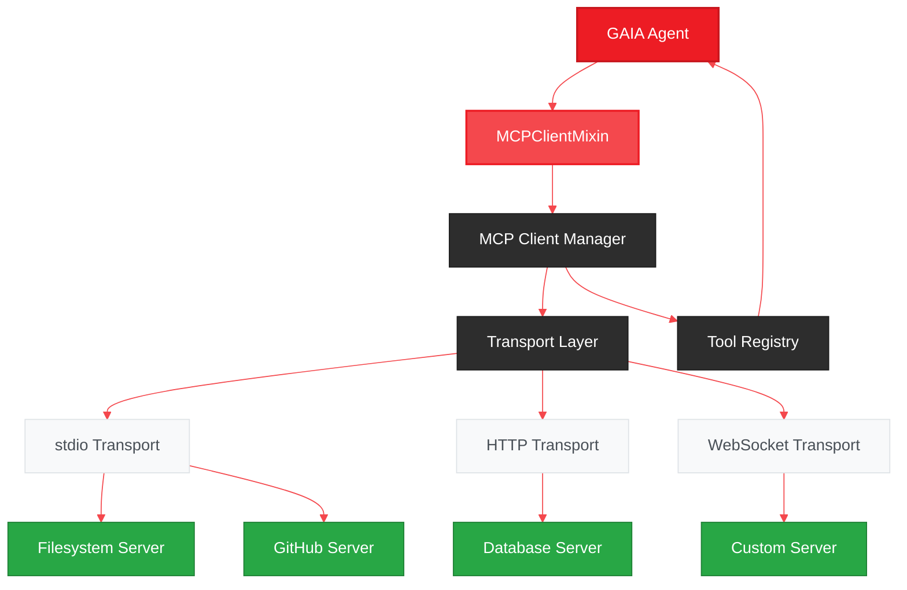
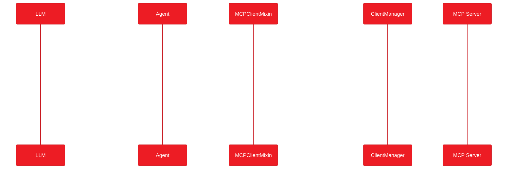
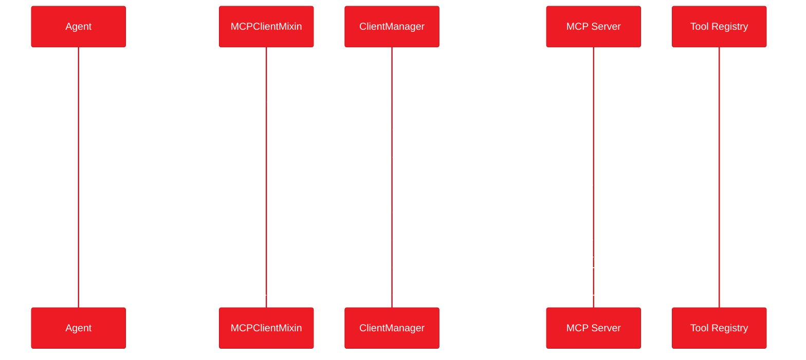

# GAIA MCP Client Support - Implementation Plan

<Info>
**Status:** Planning
**Priority:** High
[Vote with 👍 on GitHub](https://github.com/amd/gaia/issues/203)
</Info>

## Executive Summary

Add **universal MCP Client support** to GAIA, enabling any agent to connect to and use tools from external MCP servers. This unlocks the entire MCP ecosystem - filesystem access, databases, web search, GitHub, Slack, and hundreds of community-built servers.

**Goal:** Any GAIA agent can use any MCP server's tools with zero code changes.

---

## The Problem

GAIA agents currently have limited ways to interact with external services:

| Current Approach | Limitation |
|-----------------|------------|
| Custom tool implementation | Requires code for each integration |
| MCP Server (outbound only) | GAIA can be a server, not a client |
| HTTP APIs | Manual integration, no standardization |

Meanwhile, the MCP ecosystem is exploding with servers for:
- **Filesystem** - Read/write files, search directories
- **Databases** - PostgreSQL, SQLite, MongoDB queries
- **Web** - Search, fetch, browse
- **Git/GitHub** - Repository operations, PR management
- **Slack/Discord** - Messaging and notifications
- **And hundreds more** - [MCP Server Registry](https://github.com/modelcontextprotocol/servers)

---

## The Solution

A **MCPClientMixin** that any agent can inherit to gain access to external MCP servers:

```python
from gaia.agents.base.agent import Agent
from gaia.agents.base.mcp_client_mixin import MCPClientMixin

class MyAgent(MCPClientMixin, Agent):
    def __init__(self):
        super().__init__()
        # Connect to MCP servers
        self.connect_mcp_server("filesystem", "npx @modelcontextprotocol/server-filesystem /home")
        self.connect_mcp_server("github", "npx @modelcontextprotocol/server-github")

    def _register_tools(self):
        # MCP server tools are auto-registered!
        # They appear as: mcp_filesystem_read_file, mcp_github_create_issue, etc.
        pass
```

<CardGroup cols={3}>
  <Card title="Zero Code" icon="wand-magic-sparkles">
    MCP tools auto-register as agent tools
    No manual wrapping needed
  </Card>
  <Card title="Any Server" icon="plug">
    Works with any MCP-compatible server
    stdio, HTTP, WebSocket transports
  </Card>
  <Card title="Config-Driven" icon="file-code">
    Define servers in YAML/JSON
    No code changes to add new tools
  </Card>
</CardGroup>

---

## Architecture



### Components

| Component | Purpose | Location |
|-----------|---------|----------|
| **MCPClientMixin** | Agent mixin for MCP client capabilities | `src/gaia/agents/base/mcp_client_mixin.py` |
| **MCPClient** | Generic MCP protocol client | `src/gaia/mcp/client.py` |
| **MCPClientManager** | Manages multiple server connections | `src/gaia/mcp/client_manager.py` |
| **Transport Layer** | stdio/HTTP/WebSocket adapters | `src/gaia/mcp/transports/` |
| **Tool Adapter** | Converts MCP tools to GAIA @tool format | `src/gaia/mcp/tool_adapter.py` |

---

## Core Classes

### MCPClientMixin

The main interface for agents to use MCP servers:

```python
from gaia.agents.base.mcp_client_mixin import MCPClientMixin

class MCPClientMixin:
    """Mixin that adds MCP client capabilities to any agent."""

    def connect_mcp_server(
        self,
        name: str,
        command: str,
        env: Dict[str, str] = None,
        auto_register_tools: bool = True
    ) -> None:
        """
        Connect to an MCP server.

        Args:
            name: Unique identifier for this server (e.g., "filesystem")
            command: Command to start the server (e.g., "npx @mcp/server-filesystem /path")
            env: Environment variables for the server process
            auto_register_tools: If True, server tools become agent tools
        """

    def connect_mcp_server_http(
        self,
        name: str,
        url: str,
        headers: Dict[str, str] = None
    ) -> None:
        """Connect to an HTTP-based MCP server."""

    def disconnect_mcp_server(self, name: str) -> None:
        """Disconnect from an MCP server."""

    def list_mcp_tools(self, server: str = None) -> List[Dict]:
        """List available tools from connected MCP servers."""

    def call_mcp_tool(
        self,
        server: str,
        tool_name: str,
        arguments: Dict[str, Any]
    ) -> Dict[str, Any]:
        """Directly call an MCP tool."""

    def get_mcp_resource(self, server: str, uri: str) -> Any:
        """Get a resource from an MCP server."""
```

### MCPClient

Low-level MCP protocol implementation:

```python
from gaia.mcp.client import MCPClient

class MCPClient:
    """Generic MCP client supporting multiple transports."""

    async def initialize(self) -> Dict:
        """Initialize connection and get server capabilities."""

    async def list_tools(self) -> List[Dict]:
        """Get available tools from the server."""

    async def call_tool(self, name: str, arguments: Dict) -> Dict:
        """Execute a tool on the server."""

    async def list_resources(self) -> List[Dict]:
        """Get available resources."""

    async def read_resource(self, uri: str) -> Any:
        """Read a resource by URI."""

    async def list_prompts(self) -> List[Dict]:
        """Get available prompts."""

    async def get_prompt(self, name: str, arguments: Dict) -> Dict:
        """Get a rendered prompt."""
```

---

## Configuration

### Per-Agent Configuration

```python
class MyAgent(MCPClientMixin, Agent):
    MCP_SERVERS = {
        "filesystem": {
            "command": "npx @modelcontextprotocol/server-filesystem",
            "args": ["/home/user/documents"],
            "auto_tools": True
        },
        "github": {
            "command": "npx @modelcontextprotocol/server-github",
            "env": {"GITHUB_TOKEN": "${GITHUB_TOKEN}"}
        }
    }
```

### Global Configuration (mcp_servers.yaml)

```yaml
# ~/.gaia/mcp_servers.yaml
servers:
  filesystem:
    command: npx @modelcontextprotocol/server-filesystem
    args: ["/home"]
    auto_tools: true

  github:
    command: npx @modelcontextprotocol/server-github
    env:
      GITHUB_TOKEN: ${GITHUB_TOKEN}
    auto_tools: true

  postgres:
    transport: http
    url: http://localhost:3000/mcp
    headers:
      Authorization: Bearer ${DB_TOKEN}

  custom:
    command: python my_mcp_server.py
    working_dir: /path/to/server
```

### CLI Configuration

```bash
# Add a server
gaia mcp add filesystem "npx @modelcontextprotocol/server-filesystem /home"

# List configured servers
gaia mcp list

# Test a server connection
gaia mcp test filesystem

# Remove a server
gaia mcp remove filesystem
```

---

## Tool Auto-Registration

When `auto_register_tools=True`, MCP server tools automatically become agent tools:

### MCP Tool Definition (from server)

```json
{
  "name": "read_file",
  "description": "Read contents of a file",
  "inputSchema": {
    "type": "object",
    "properties": {
      "path": {"type": "string", "description": "File path"}
    },
    "required": ["path"]
  }
}
```

### Generated GAIA Tool

```python
@tool
def mcp_filesystem_read_file(path: str) -> dict:
    """Read contents of a file.

    [MCP Server: filesystem]

    Args:
        path: File path
    """
    return self._mcp_manager.call_tool("filesystem", "read_file", {"path": path})
```

### Naming Convention

MCP tools are prefixed to avoid conflicts:

| MCP Server | MCP Tool | GAIA Tool Name |
|------------|----------|----------------|
| filesystem | read_file | `mcp_filesystem_read_file` |
| github | create_issue | `mcp_github_create_issue` |
| postgres | query | `mcp_postgres_query` |

---

## Transport Support

### stdio (Default)

Most MCP servers use stdio transport:

```python
# Starts process, communicates via stdin/stdout
self.connect_mcp_server("fs", "npx @mcp/server-filesystem /home")
```

### HTTP

For servers exposing HTTP endpoints:

```python
self.connect_mcp_server_http(
    "api",
    "http://localhost:3000/mcp",
    headers={"Authorization": "Bearer token"}
)
```

### WebSocket

For real-time bidirectional communication:

```python
self.connect_mcp_server_websocket(
    "realtime",
    "ws://localhost:8080/mcp"
)
```

---

## Integration Examples

### CodeAgent with Filesystem Access

```python
from gaia.agents.code.agent import CodeAgent
from gaia.agents.base.mcp_client_mixin import MCPClientMixin

class EnhancedCodeAgent(MCPClientMixin, CodeAgent):
    """CodeAgent with filesystem access via MCP."""

    def __init__(self, workspace: str = "."):
        super().__init__()
        self.connect_mcp_server(
            "filesystem",
            f"npx @modelcontextprotocol/server-filesystem {workspace}"
        )
        # Now the agent can read/write files via MCP tools
```

### ChatAgent with Web Search

```python
from gaia.agents.chat.agent import ChatAgent
from gaia.agents.base.mcp_client_mixin import MCPClientMixin

class WebSearchChatAgent(MCPClientMixin, ChatAgent):
    """ChatAgent that can search the web."""

    def __init__(self):
        super().__init__()
        self.connect_mcp_server(
            "brave",
            "npx @anthropic/mcp-server-brave-search",
            env={"BRAVE_API_KEY": os.environ.get("BRAVE_API_KEY")}
        )
```

### Multi-Server Agent

```python
class SuperAgent(MCPClientMixin, Agent):
    """Agent with access to multiple MCP servers."""

    MCP_SERVERS = {
        "filesystem": {"command": "npx @mcp/server-filesystem /home"},
        "github": {"command": "npx @mcp/server-github"},
        "postgres": {"command": "npx @mcp/server-postgres", "env": {"DATABASE_URL": "..."}},
        "slack": {"command": "npx @mcp/server-slack", "env": {"SLACK_TOKEN": "..."}}
    }

    def _get_system_prompt(self):
        return """You have access to:
        - Filesystem: read/write files
        - GitHub: manage repositories and issues
        - PostgreSQL: query databases
        - Slack: send messages

        Use these tools to help the user."""
```

---

## CLI Commands

### Server Management

```bash
# Add MCP server
gaia mcp add <name> <command> [--env KEY=VALUE] [--no-auto-tools]

# List servers
gaia mcp list [--verbose]

# Test connection
gaia mcp test <name>

# Remove server
gaia mcp remove <name>

# Show server tools
gaia mcp tools <name>
```

### Examples

```bash
# Add filesystem server
gaia mcp add filesystem "npx @modelcontextprotocol/server-filesystem /home/user"

# Add GitHub server with environment variable
gaia mcp add github "npx @modelcontextprotocol/server-github" --env GITHUB_TOKEN=$GITHUB_TOKEN

# List all configured servers
gaia mcp list
# Output:
# NAME        COMMAND                                      STATUS
# filesystem  npx @mcp/server-filesystem /home/user        connected (5 tools)
# github      npx @mcp/server-github                       connected (12 tools)

# Test a server
gaia mcp test filesystem
# Output:
# ✓ Server 'filesystem' is healthy
# Tools: read_file, write_file, list_directory, search_files, get_file_info

# Show tools from a server
gaia mcp tools github
# Output:
# TOOL                  DESCRIPTION
# create_issue          Create a new GitHub issue
# list_issues           List issues in a repository
# create_pull_request   Create a pull request
# ...
```

---

## Implementation Plan

<Steps>
  <Step title="Core Client">
    MCPClient class with stdio transport, JSON-RPC protocol, tool/resource/prompt support
  </Step>
  <Step title="Client Manager">
    MCPClientManager for managing multiple server connections, lifecycle management
  </Step>
  <Step title="Tool Adapter">
    Convert MCP tool schemas to GAIA @tool format, auto-registration, naming conventions
  </Step>
  <Step title="MCPClientMixin">
    Agent mixin with connect/disconnect/call methods, configuration support
  </Step>
  <Step title="HTTP/WebSocket Transports">
    Additional transport implementations for non-stdio servers
  </Step>
  <Step title="CLI Commands">
    `gaia mcp add/remove/list/test/tools` commands for server management
  </Step>
  <Step title="Configuration">
    YAML config file support, environment variable expansion, per-agent config
  </Step>
  <Step title="Documentation & Examples">
    SDK docs, integration guide, example agents
  </Step>
</Steps>

---

## Data Flow

### Tool Invocation Flow



### Server Initialization Flow



---

## Success Metrics

| Metric | Target |
|--------|--------|
| Server connection time | < 2 seconds |
| Tool invocation latency | < 100ms overhead |
| Supported transports | stdio, HTTP, WebSocket |
| MCP protocol version | 1.0+ compatible |
| Auto-registered tools accuracy | 100% schema conversion |

---

## Compatibility

### MCP Protocol Support

| Feature | Support |
|---------|---------|
| Tools | Full |
| Resources | Full |
| Prompts | Full |
| Sampling | Planned |
| Logging | Full |

### Tested MCP Servers

| Server | Status |
|--------|--------|
| @modelcontextprotocol/server-filesystem | Primary target |
| @modelcontextprotocol/server-github | Primary target |
| @modelcontextprotocol/server-postgres | Planned |
| @anthropic/mcp-server-brave-search | Planned |
| Custom servers | Supported via standard protocol |

---

## Security Considerations

<Warning>
MCP servers can execute arbitrary code. Only connect to trusted servers.
</Warning>

### Security Features

1. **Sandboxing** - Option to run servers in containers
2. **Permission prompts** - Confirm before connecting to new servers
3. **Audit logging** - Log all tool invocations
4. **Environment isolation** - Separate env vars per server
5. **Network restrictions** - Optional allowlist for HTTP servers

### Configuration

```yaml
# ~/.gaia/mcp_servers.yaml
security:
  require_confirmation: true  # Prompt before first connection
  audit_log: true            # Log all tool calls
  allowed_commands:          # Allowlist for stdio servers
    - npx @modelcontextprotocol/*
    - python */mcp_server.py
```

---

## Future Enhancements

- **Server discovery** - Auto-discover MCP servers on network
- **Tool caching** - Cache tool schemas for faster startup
- **Streaming responses** - Support for streaming tool results
- **Multi-agent sharing** - Share MCP connections across agents
- **Server health monitoring** - Auto-reconnect on failure

---

## Related

- [Roadmap](/roadmap) - High-level feature timeline
- [MCP Server Support](/sdk/infrastructure/mcp) - Exposing GAIA as MCP server
- [Tool System](/sdk/core/tools) - GAIA tool decorator
- [MCP Docs Server Plan](/plans/mcp-docs) - Documentation MCP server

