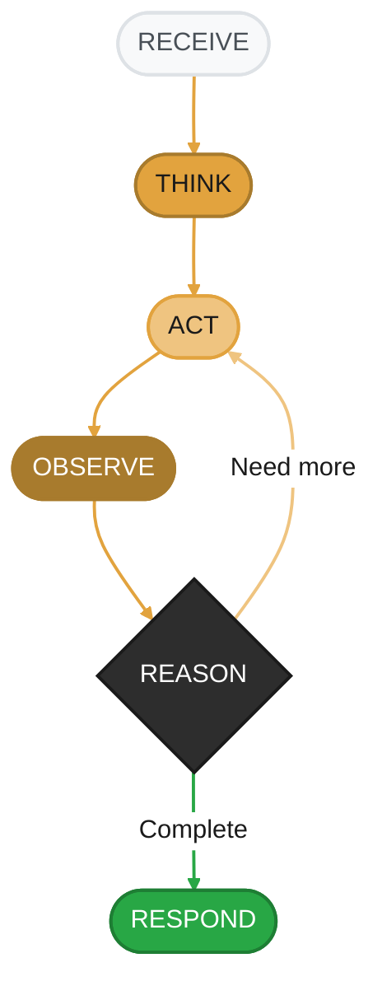

<Note>
📖 **You are viewing:** Conceptual Guide - Learn how agents work and build your first agent

**See also:** [API Specification](/spec/agent-base) · [Quickstart Tutorial](/quickstart)
</Note>

<Info>
  **Source Code:** [`src/gaia/agents/base/agent.py`](https://github.com/amd/gaia/blob/main/src/gaia/agents/base/agent.py)
</Info>

<Badge text="development" color="orange" />

<Info>
**What You'll Learn**
- What an agent is and why it's more powerful than calling an LLM directly
- How the agent reasoning loop works under the hood
- How to build your first agent from scratch
- How to configure agents for different use cases
- Common pitfalls and how to avoid them
</Info>

---

## What is an Agent?

An **agent** is more than just an LLM. Think of the difference like this:

| LLM Alone | Agent |
|-----------|-------|
| Can only generate text | Can take actions in the world |
| No memory between calls | Remembers conversation context |
| Can't use external tools | Has access to your tools |
| Single response | Can plan multi-step workflows |
| Fails silently on errors | Recovers and retries automatically |

**Real-world analogy:** An LLM is like a brilliant consultant who can only give advice. An agent is that same consultant, but now they have a phone, a computer, and access to your company's systems—they can actually *do* the work.

### Why Use Agents?

<Tabs>
<Tab title="Without Agent">
```python
# Direct LLM call - limited to text generation
from gaia.llm import create_client

llm = create_client()  # LLMClient is abstract; use the factory
response = llm.generate("What's the weather in Seattle?")
# Response: "I don't have access to weather data..."
```
The LLM can only tell you it doesn't know.
</Tab>
<Tab title="With Agent">
```python
# Agent with weather tool - can take action
from gaia import Agent

class WeatherAgent(Agent):
    # ... (with weather tool)

agent = WeatherAgent()
response = agent.process_query("What's the weather in Seattle?")
# Response: "It's currently 55°F and rainy in Seattle."
```
The agent calls a weather API and returns real data.
</Tab>
</Tabs>

---

## How Agents Work: The Reasoning Loop

When you send a message to an agent, it doesn't just generate a response. It enters a **reasoning loop**:



<Note>
**Key Insight:** The loop can repeat! If the LLM decides it needs more information after step 5, it goes back to step 3 and executes another tool. This enables complex multi-step reasoning.
</Note>

### Agent States

During processing, agents transition through different states:

| State | What's Happening | When It Occurs |
|-------|------------------|----------------|
| `STATE_PLANNING` | Agent is analyzing the request and deciding approach | Complex queries requiring multiple steps |
| `STATE_EXECUTING_PLAN` | Agent is executing a multi-step plan | Following a planned sequence |
| `STATE_DIRECT_EXECUTION` | Agent executes tools immediately | Simple, clear requests |
| `STATE_ERROR_RECOVERY` | Agent is handling a tool failure | When a tool throws an error |
| `STATE_COMPLETION` | Agent has finished and is generating response | Final step before returning |

You can check the current state in your tools if you need conditional behavior:

```python
@tool
def my_tool(self) -> dict:
    """A tool that behaves differently during error recovery."""
    if self.execution_state == self.STATE_ERROR_RECOVERY:
        # Be more conservative during error recovery
        return {"status": "skipped", "reason": "In recovery mode"}
    # Normal execution
    return {"status": "success", "data": "..."}
```

---

## Building Your First Agent

Let's build an agent step by step, starting simple and adding features progressively.

### Step 1: The Minimal Agent

Every agent needs three things:
1. **A system prompt** - Tells the LLM who it is
2. **A console** - Handles output display
3. **Tools** - What the agent can do

```python
from gaia.agents.base.agent import Agent
from gaia.agents.base.console import AgentConsole

class MinimalAgent(Agent):
    """The simplest possible GAIA agent."""

    def _get_system_prompt(self) -> str:
        # This is what the LLM "believes" about itself
        return "You are a helpful assistant."

    def _create_console(self):
        # AgentConsole provides colorful CLI output
        return AgentConsole()

    def _register_tools(self):
        # No tools yet - agent can only chat
        pass

# Create and use
agent = MinimalAgent()
result = agent.process_query("Hello! What can you help me with?")
print(result["result"])
```

**What happens when you run this:**
1. Agent receives "Hello! What can you help me with?"
2. LLM sees: System prompt + User message
3. LLM generates a conversational response
4. Agent returns the response

<Warning>
Without tools, this agent is essentially just an LLM wrapper. The power of agents comes from giving them tools to use.
</Warning>

### Step 2: Adding Your First Tool

Let's give the agent the ability to tell time:

```python
from gaia.agents.base.agent import Agent
from gaia.agents.base.tools import tool
from gaia.agents.base.console import AgentConsole
from datetime import datetime

class TimeAgent(Agent):
    """Agent that can tell you the current time."""

    def _get_system_prompt(self) -> str:
        return """You are a helpful assistant that can tell the time.
        When users ask about time, use the get_current_time tool."""

    def _create_console(self):
        return AgentConsole()

    def _register_tools(self):
        @tool
        def get_current_time() -> dict:
            """Get the current date and time.

            Use this tool when the user asks:
            - What time is it?
            - What's the date?
            - What day is it?

            Returns:
                Dictionary with time, date, and day of week
            """
            now = datetime.now()
            return {
                "time": now.strftime("%I:%M %p"),
                "date": now.strftime("%B %d, %Y"),
                "day": now.strftime("%A")
            }

# Test it
agent = TimeAgent()
result = agent.process_query("What time is it?")
print(result["result"])  # "It's 2:30 PM on Thursday, January 9, 2025"
```

**What happens now:**
1. User asks "What time is it?"
2. LLM sees the `get_current_time` tool and its description
3. LLM decides: "This matches 'What time is it?' - I should use this tool"
4. Agent executes `get_current_time()`, gets `{"time": "2:30 PM", ...}`
5. LLM receives the result and generates a natural response

<Tip>
**The docstring is crucial!** The LLM reads the docstring to decide when to use a tool. "Use this tool when..." patterns are especially effective.
</Tip>

### Step 3: Adding External Capabilities

Now let's build something more practical—an agent that can fetch weather data:

```python
from gaia.agents.base.agent import Agent
from gaia.agents.base.tools import tool
from gaia.agents.base.console import AgentConsole
import requests
import os

class WeatherAgent(Agent):
    """Agent that provides real weather information."""

    def __init__(self, **kwargs):
        # Store API key before calling super().__init__
        # (super().__init__ calls _register_tools, which needs api_key)
        self.api_key = os.getenv("WEATHER_API_KEY")
        super().__init__(**kwargs)

    def _get_system_prompt(self) -> str:
        return """You are a weather assistant.

        When users ask about weather:
        1. Use get_weather to fetch current conditions
        2. Present the information in a friendly, conversational way
        3. Include temperature, conditions, and any relevant warnings

        Be helpful and proactive - if someone asks about weather for travel,
        mention if they should bring an umbrella or jacket."""

    def _create_console(self):
        return AgentConsole()

    def _register_tools(self):
        @tool
        def get_weather(city: str, country_code: str = "US") -> dict:
            """Get current weather for a city.

            Args:
                city: Name of the city (e.g., "Seattle", "London")
                country_code: Two-letter country code (default: US)

            Use this tool when users ask about:
            - Current weather conditions
            - Temperature
            - Whether they need an umbrella/jacket

            Returns:
                Dictionary with temperature, conditions, humidity, wind
            """
            try:
                url = f"https://api.openweathermap.org/data/2.5/weather"
                params = {
                    "q": f"{city},{country_code}",
                    "appid": self.api_key,
                    "units": "imperial"
                }
                response = requests.get(url, params=params, timeout=10)
                data = response.json()

                if response.status_code != 200:
                    return {
                        "status": "error",
                        "error": data.get("message", "Unknown error"),
                        "suggestion": "Check the city name spelling"
                    }

                return {
                    "status": "success",
                    "city": city,
                    "temperature_f": round(data["main"]["temp"]),
                    "feels_like_f": round(data["main"]["feels_like"]),
                    "conditions": data["weather"][0]["description"],
                    "humidity": data["main"]["humidity"],
                    "wind_mph": round(data["wind"]["speed"])
                }

            except requests.Timeout:
                return {
                    "status": "error",
                    "error": "Weather service timed out",
                    "suggestion": "Try again in a moment"
                }
            except Exception as e:
                return {
                    "status": "error",
                    "error": str(e),
                    "suggestion": "Check your internet connection"
                }

# Usage
agent = WeatherAgent()
result = agent.process_query("What's the weather like in Seattle?")
print(result["result"])

# Multi-turn conversation works too
result = agent.process_query("How about in Miami?")
print(result["result"])
```

**Key patterns demonstrated:**
1. **Instance variables** (`self.api_key`) - Store configuration in `__init__`
2. **Tool parameters with defaults** (`country_code="US"`) - LLM learns optional params
3. **Error handling** - Return error info, don't raise exceptions
4. **Timeout handling** - External APIs can be slow
5. **Rich system prompt** - Guides LLM behavior beyond just tool selection

---

## Configuration Deep Dive

Agents accept many configuration parameters. Here's what each one does:

```python
agent = MyAgent(
    # === LLM Selection ===
    use_claude=False,              # Use Anthropic Claude API
    use_chatgpt=False,             # Use OpenAI ChatGPT API
    # If both are False, uses local Lemonade Server

    # === Local LLM Settings ===
    base_url="http://localhost:13305/api/v1",  # Lemonade server URL
    model_id="Gemma-4-E4B-it-GGUF",  # Model to use

    # === Cloud LLM Settings ===
    claude_model="claude-sonnet-4-20250514",  # Claude model version
    # API keys are read from environment: ANTHROPIC_API_KEY, OPENAI_API_KEY

    # === Agent Behavior ===
    max_steps=20,                  # Max reasoning loop iterations
    streaming=True,                # Stream responses token-by-token
    silent_mode=False,             # Suppress console output

    # === Debugging ===
    debug_prompts=False,           # Print raw prompts to console
    show_prompts=False,            # Show prompts in output
)
```

### Choosing Your LLM Backend

<Accordion title="Option 1: Local LLM (Default) - Free, Private, Fast">

Uses AMD-optimized [Lemonade Server](https://lemonade-server.ai) running on your machine:

```python
# Default - uses local Lemonade Server
agent = MyAgent()

# Or explicitly configure
agent = MyAgent(
    base_url="http://localhost:13305/api/v1",
    model_id="Qwen3.5-35B-A3B-GGUF"
)
```

**Pros:**
- Free (no API costs)
- Data stays on your machine (privacy)
- Fast inference on AMD hardware (NPU/iGPU acceleration)

**Cons:**
- Requires Lemonade Server running
- Smaller models than cloud options
- Local compute resources needed

**Best for:** Development, privacy-sensitive applications, offline use.
</Accordion>

<Accordion title="Option 2: Claude API - Best Reasoning">

Uses Anthropic's Claude models:

```bash
# Set your API key
export ANTHROPIC_API_KEY="your-key-here"
```

```python
agent = MyAgent(
    use_claude=True,
    claude_model="claude-sonnet-4-20250514"
)
```

**Pros:**
- Excellent reasoning and code understanding
- Large context window
- Most capable for complex tasks

**Cons:**
- API costs (pay per token)
- Requires internet connection
- Data sent to Anthropic

**Best for:** Complex reasoning, production applications, code analysis.
</Accordion>

<Accordion title="Option 3: ChatGPT API - Wide Compatibility">

Uses OpenAI's GPT models:

```bash
# Set your API key
export OPENAI_API_KEY="your-key-here"
```

```python
agent = MyAgent(
    use_chatgpt=True
)
```

**Pros:**
- Wide tool support
- Familiar API
- Good general performance

**Cons:**
- API costs
- Requires internet connection

**Best for:** Integration with existing OpenAI workflows.
</Accordion>

### Tuning Agent Behavior

| Parameter | Low Value | High Value | Trade-off |
|-----------|-----------|------------|-----------|
| `max_steps` | `3` - Quick tasks | `20` - Complex workflows | Speed vs. thoroughness |
| `streaming` | `False` - Wait for complete response | `True` - See tokens as generated | Latency vs. responsiveness |
| `silent_mode` | `False` - See all output | `True` - Only get results | Visibility vs. clean output |

---

## Common Pitfalls and Solutions

<AccordionGroup>
<Accordion title="Pitfall 1: Agent doesn't use my tools">

**Symptom:** Agent gives generic responses instead of using your tools.

**Cause:** Tool docstrings don't clearly explain when to use them.

```python
# ❌ Vague docstring
@tool
def search(query: str) -> str:
    """Search for things."""
    ...

# ✅ Clear docstring with triggers
@tool
def search_codebase(query: str) -> str:
    """Search for code in the project files.

    Use this tool when the user wants to:
    - Find functions, classes, or variables
    - Search for code patterns
    - Locate specific implementations

    Do NOT use for web searches - use search_web instead.
    """
    ...
```

</Accordion>

<Accordion title="Pitfall 2: Agent gets stuck in loops">

**Symptom:** Agent keeps calling tools repeatedly without making progress.

**Cause:** Usually means `max_steps` is too high, or tools return ambiguous results.

**Solutions:**
```python
# 1. Limit max steps
agent = MyAgent(max_steps=5)

# 2. Return clear success/failure status
@tool
def my_tool() -> dict:
    return {
        "status": "success",  # or "error" or "not_found"
        "data": result,
        "action_needed": None  # Tell LLM no more action needed
    }

# 3. Add completion hints in system prompt
def _get_system_prompt(self):
    return """...
    When you have answered the user's question, stop and respond.
    Don't keep searching for more information unless asked.
    """
```

</Accordion>

<Accordion title="Pitfall 3: Tool errors crash the agent">

**Symptom:** Agent stops working when a tool encounters an error.

**Cause:** Raising exceptions in tools instead of returning error information.

```python
# ❌ Raises exception - crashes agent
@tool
def fetch_data(url: str) -> dict:
    response = requests.get(url)
    response.raise_for_status()  # Raises on HTTP error!
    return response.json()

# ✅ Returns error info - agent can recover
@tool
def fetch_data(url: str) -> dict:
    """Fetch data from URL."""
    try:
        response = requests.get(url, timeout=10)
        response.raise_for_status()
        return {
            "status": "success",
            "data": response.json()
        }
    except requests.HTTPError as e:
        return {
            "status": "error",
            "error": f"HTTP {e.response.status_code}",
            "suggestion": "Check if the URL is correct"
        }
    except requests.Timeout:
        return {
            "status": "error",
            "error": "Request timed out",
            "suggestion": "Try again or check your connection"
        }
```

</Accordion>

<Accordion title="Pitfall 4: Context getting too long">

**Symptom:** Agent becomes slow or starts giving inconsistent responses.

**Cause:** Conversation history or tool results exceeding context limits.

**Solutions:**
```python
# 1. Truncate tool output
@tool
def read_file(path: str) -> dict:
    """Read a file (first 200 lines)."""
    with open(path) as f:
        lines = f.readlines()[:200]
    content = "".join(lines)
    if len(lines) == 200:
        content += "\n... (truncated)"
    return {"content": content}

# 2. Summarize large results
@tool
def search_all(query: str) -> dict:
    results = perform_search(query)
    if len(results) > 20:
        return {
            "total": len(results),
            "showing": 20,
            "results": results[:20],
            "note": f"Showing first 20 of {len(results)} results"
        }
    return {"results": results}
```

</Accordion>
</AccordionGroup>

---

## Practice Challenge

<Card title="Build a File Explorer Agent" icon="folder">
Create an agent that can:
1. List files in a directory
2. Read file contents
3. Search for text in files

**Requirements:**
- Handle errors gracefully (missing files, permission denied)
- Limit file content to prevent context overflow
- Clear tool docstrings that guide the LLM

<Accordion title="Hints">
- Use `os.listdir()` for listing files
- Use `os.path.isfile()` to check if path is a file
- Catch `FileNotFoundError` and `PermissionError`
- Return structured dicts with status fields
</Accordion>

<Accordion title="Solution">
```python
from gaia.agents.base.agent import Agent
from gaia.agents.base.tools import tool
from gaia.agents.base.console import AgentConsole
import os

class FileExplorerAgent(Agent):
    """Agent for exploring and reading files."""

    def __init__(self, allowed_path: str = ".", **kwargs):
        self.allowed_path = os.path.abspath(allowed_path)
        super().__init__(**kwargs)

    def _get_system_prompt(self) -> str:
        return f"""You are a file explorer assistant.
        You can list directories, read files, and search for text.
        You are restricted to: {self.allowed_path}

        When exploring:
        1. Start by listing the directory
        2. Read specific files when asked
        3. Search when looking for specific content"""

    def _create_console(self):
        return AgentConsole()

    def _register_tools(self):
        @tool
        def list_directory(path: str = ".") -> dict:
            """List files and folders in a directory.

            Args:
                path: Relative path from allowed directory

            Use when user wants to see what files exist.
            """
            full_path = os.path.join(self.allowed_path, path)
            if not full_path.startswith(self.allowed_path):
                return {"status": "error", "error": "Path outside allowed area"}

            try:
                items = os.listdir(full_path)
                files = [f for f in items if os.path.isfile(os.path.join(full_path, f))]
                dirs = [d for d in items if os.path.isdir(os.path.join(full_path, d))]
                return {
                    "status": "success",
                    "path": path,
                    "files": files[:50],  # Limit
                    "directories": dirs[:50]
                }
            except FileNotFoundError:
                return {"status": "error", "error": "Directory not found"}
            except PermissionError:
                return {"status": "error", "error": "Permission denied"}

        @tool
        def read_file(path: str, max_lines: int = 100) -> dict:
            """Read contents of a file.

            Args:
                path: Relative path to file
                max_lines: Maximum lines to return (default 100)

            Use when user wants to see file contents.
            """
            full_path = os.path.join(self.allowed_path, path)
            if not full_path.startswith(self.allowed_path):
                return {"status": "error", "error": "Path outside allowed area"}

            try:
                with open(full_path, 'r') as f:
                    lines = f.readlines()[:max_lines]
                truncated = len(lines) == max_lines
                return {
                    "status": "success",
                    "path": path,
                    "content": "".join(lines),
                    "truncated": truncated,
                    "lines_shown": len(lines)
                }
            except FileNotFoundError:
                return {"status": "error", "error": "File not found"}
            except PermissionError:
                return {"status": "error", "error": "Permission denied"}
            except UnicodeDecodeError:
                return {"status": "error", "error": "Binary file - cannot read as text"}

        @tool
        def search_in_files(query: str, file_pattern: str = "*") -> dict:
            """Search for text in files.

            Args:
                query: Text to search for
                file_pattern: Glob pattern (default: all files)

            Use when user wants to find specific text.
            """
            import glob
            matches = []
            pattern = os.path.join(self.allowed_path, "**", file_pattern)

            for filepath in glob.glob(pattern, recursive=True)[:100]:  # Limit files
                try:
                    with open(filepath, 'r') as f:
                        for i, line in enumerate(f, 1):
                            if query.lower() in line.lower():
                                rel_path = os.path.relpath(filepath, self.allowed_path)
                                matches.append({
                                    "file": rel_path,
                                    "line": i,
                                    "content": line.strip()[:200]
                                })
                                if len(matches) >= 20:  # Limit matches
                                    return {
                                        "status": "success",
                                        "matches": matches,
                                        "note": "Showing first 20 matches"
                                    }
                except (PermissionError, UnicodeDecodeError):
                    continue

            return {
                "status": "success",
                "matches": matches,
                "total": len(matches)
            }

# Usage
agent = FileExplorerAgent(allowed_path="./my_project")
result = agent.process_query("What Python files are in the src folder?")
print(result["result"])
```

**Why this solution works:**
1. **Security:** Validates paths stay within allowed directory
2. **Error handling:** Returns informative error dicts instead of raising
3. **Context limits:** Truncates large results to prevent overflow
4. **Clear docstrings:** LLM knows exactly when to use each tool
5. **Configurable:** `allowed_path` restricts scope for safety
</Accordion>
</Card>

---

## Deep Dive: Under the Hood

<Accordion title="How process_query() Works Internally">

When you call `agent.process_query(user_input)`, here's the detailed flow:

```python
def process_query(self, user_input, max_steps=None):  # defaults to self.max_steps (20)
    # 1. Add user message to conversation history
    self.conversation_history.append({
        "role": "user",
        "content": user_input
    })

    # 2. Build the full prompt for the LLM
    prompt = self._build_prompt()
    # Includes: system prompt + tool definitions + conversation history

    # 3. Enter the reasoning loop
    for step in range(max_steps):
        # 4. Call LLM
        response = self.llm.generate(prompt)

        # 5. Parse response - is it a tool call or final answer?
        if self._is_tool_call(response):
            # 6a. Execute the tool
            tool_name, tool_args = self._parse_tool_call(response)
            tool_result = self.execute_tool(tool_name, tool_args)

            # 7. Add tool result to history
            self.conversation_history.append({
                "role": "tool",
                "name": tool_name,
                "content": str(tool_result)
            })

            # 8. Rebuild prompt with new information
            prompt = self._build_prompt()
            # Loop continues...

        else:
            # 6b. It's a final answer
            self.conversation_history.append({
                "role": "assistant",
                "content": response
            })
            return {"status": "success", "result": response, "steps_taken": step + 1}

    # 9. Max steps reached
    return {"status": "incomplete", "result": "I couldn't complete the task", "steps_taken": max_steps}
```

**Key insight:** The conversation history grows with each tool call, giving the LLM more context for its next decision.

</Accordion>

<Accordion title="How Tool Registration Works">

The `@tool` decorator does several things:

```python
def tool(func):
    # 1. Extract the function signature
    sig = inspect.signature(func)

    # 2. Build a per-parameter map from type hints + the docstring's Args: block.
    #    The whole docstring is stored once as `description`; each argument also
    #    carries its own line so the model reads it at the slot it fills.
    arg_descriptions = parse_arg_descriptions(func.__doc__)
    params = {}
    for name, param in sig.parameters.items():
        params[name] = {
            "type": python_type_to_json_type(param.annotation),  # str→string, List[str]→array, …
            "required": param.default is inspect.Parameter.empty,
        }
        if arg_descriptions.get(name):
            params[name]["description"] = arg_descriptions[name]

    # 3. Register in the global _TOOL_REGISTRY under the function name.
    _TOOL_REGISTRY[func.__name__] = {
        "name": func.__name__,
        "description": func.__doc__ or "",  # whole docstring, not per-arg
        "parameters": params,
        "function": func,
        "atomic": False,
    }
    return func  # returned unchanged
```

The function name, type hints, and docstring are what the LLM sees, which is why
they matter so much. See the [Tools guide](./tools) for the authoritative
walkthrough of the registry entry.

</Accordion>

---

## Verification Scope

Every answer the agent loop emits ends with one line saying whether the result
was actually checked. Without it, "done" reads the same whether the agent ran
the test suite or ran nothing at all, and the only rational response is to
distrust every completion message.

```text
Fixed the off-by-one in the pagination helper.

Verification: verified — pytest ran and passed.
```

Three states, derived from the tool calls that actually executed during the
turn — no extra model call:

| State | When |
|-------|------|
| `verified` | At least one test / lint / build ran, and every one passed. |
| `partially verified` | Checks ran, but not all of them passed. |
| `unverified` | No check ran. Names how many tools did run, if any. |

A call counts as a check when the tool is one of `run_tests`, `run_lint`,
`typecheck`, or `build`, or when its `command` argument names a known runner
(`pytest`, `ruff`, `npm test`, `cargo test`, `go test`, `tsc`, …). The
classifier also recognizes completed `execute_python_file` results containing a
pytest summary or unittest run summary and an integer exit code. Reading a file
containing test output, a refusal, or an ordinary script exit does not establish
that tests ran. Other unrecognized runners remain `unverified`.

The statement rides in the emitted answer, so it reaches every surface — the
CLI console, the SSE `answer` event, and `process_query`'s return value — and
it is capped at `VERIFICATION_SCOPE_MAX_CHARS` (200) so it cannot grow the
prompt as conversation history accumulates.

```python
from gaia.agents.base.verification import strip_verification_scope

answer_only = strip_verification_scope(result["result"])
```

<Note>
A turn cancelled from the UI returns an empty result on purpose, and carries no
statement — filling it in would make a cancelled turn look like a completed one.
</Note>

---

## Proactive Lifecycle Hooks

Beyond responding to a user prompt, an agent can act **proactively** — proposing
work on first run or during a steady-state loop. The base `Agent` exposes three
methods for this (issue #1484):

| Method | When it runs | Returns |
|--------|--------------|---------|
| `on_first_run(context)` | Once, on initial discovery | `List[Proposal]` |
| `on_heartbeat(context)` | Each steady-state tick | `List[Proposal]` |
| `propose(proposal)` | Called by your hook to submit a proposal | `Goal` |

All three are **no-ops by default** — a plain agent never acts on its own, and
`process_query()` never triggers them. You opt in by overriding the hooks.

**Every proposal requires explicit user approval before anything runs.**
`propose()` parks the proposal in `pending_approval`; nothing executes until the
user accepts it. Proposals also carry a **risk tier** (`low` / `medium` / `high`
/ `critical`) — it's stored as signal to help the approving user prioritize, but
it never gates execution: even `risk="low"` proposals wait for approval, per the
[autonomous agent spec](https://github.com/amd/gaia/blob/main/docs/spec/autonomous-agent-mode.md).

### Example: a proactive workspace agent

```python
from typing import Any, Dict, List, Optional

from gaia.agents.base.agent import Agent
from gaia.agents.base.console import SilentConsole
from gaia.agents.base.goal_store import Proposal


class WorkspaceAgent(Agent):
    def _get_system_prompt(self) -> str:
        return "You help keep a project workspace tidy."

    def _create_console(self):
        return SilentConsole()

    def _register_tools(self):
        pass

    def on_first_run(self, context: Optional[Dict[str, Any]]) -> List[Proposal]:
        # Reading a directory is safe -> low risk, but still needs approval.
        return [
            Proposal(
                action="index_workspace",
                rationale="No index found; build one for fast retrieval.",
                action_class="file_read",
                risk="low",
            )
        ]

    def on_heartbeat(self, context: Optional[Dict[str, Any]]) -> List[Proposal]:
        # Deleting files is destructive -> needs explicit approval.
        return [
            Proposal(
                action="archive_stale_logs",
                rationale="12 log files older than 30 days.",
                action_class="file_write",
                risk="high",
            )
        ]


agent = WorkspaceAgent(silent_mode=True, skip_lemonade=True)

for proposal in agent.on_first_run(context=None):
    goal = agent.propose(proposal)          # low risk -> still awaits the user
    print(goal.status)                       # "pending_approval"

for proposal in agent.on_heartbeat(context=None):
    goal = agent.propose(proposal)          # high risk -> awaits the user
    print(goal.status)                       # "pending_approval"
```

<Warning>
`propose()` does not swallow failures — a `GoalStore` database error propagates
so the caller sees it, per GAIA's no-silent-fallbacks rule (see
[`docs/reference/dev`](https://amd-gaia.ai/docs/reference/dev)).
</Warning>

---

## Key Takeaways

<CardGroup cols={2}>
<Card title="Agents = LLM + Tools + Memory" icon="brain">
Agents can plan, act, observe, and reason—not just generate text.
</Card>
<Card title="Three Required Methods" icon="code">
Every agent needs: `_get_system_prompt()`, `_create_console()`, `_register_tools()`
</Card>
<Card title="Docstrings Teach the LLM" icon="book">
The LLM only sees your docstring—make it clear when to use each tool.
</Card>
<Card title="Return Errors, Don't Raise" icon="shield">
Tools should return error info as data so the agent can recover gracefully.
</Card>
</CardGroup>

---

## Next Steps

<CardGroup cols={3}>
<Card title="Tool Decorator" icon="wrench" href="./tools">
Deep dive into creating effective tools
</Card>
<Card title="Console Output" icon="terminal" href="./console">
Customize how your agent displays output
</Card>
<Card title="User Guides" icon="robot" href="/guides/index">
See pre-built agents for chat, code, Jira, Blender
</Card>
</CardGroup>

---

<small style={{color: "#666"}}>
Copyright(C) 2024-2026 Advanced Micro Devices, Inc. All rights reserved.
SPDX-License-Identifier: MIT
</small>
