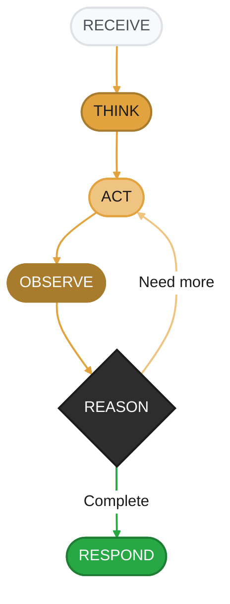

<Note>
📖 **You are viewing:** Conceptual Guide - Learn how agents work and build your first agent

**See also:** [API Specification](/spec/agent-base) · [Quickstart Tutorial](/quickstart)
</Note>

<Info>
  **Source Code:** [`src/gaia/agents/base/agent.py`](https://github.com/amd/gaia/blob/main/src/gaia/agents/base/agent.py)
</Info>

<Badge text="development" color="orange" />

<Info>
**What You'll Learn**
- What an agent is and why it's more powerful than calling an LLM directly
- How the agent reasoning loop works under the hood
- How to build your first agent from scratch
- How to configure agents for different use cases
- Common pitfalls and how to avoid them
</Info>

---

## What is an Agent?

An **agent** is more than just an LLM. Think of the difference like this:

| LLM Alone | Agent |
|-----------|-------|
| Can only generate text | Can take actions in the world |
| No memory between calls | Remembers conversation context |
| Can't use external tools | Has access to your tools |
| Single response | Can plan multi-step workflows |
| Fails silently on errors | Recovers and retries automatically |

**Real-world analogy:** An LLM is like a brilliant consultant who can only give advice. An agent is that same consultant, but now they have a phone, a computer, and access to your company's systems—they can actually *do* the work.

### Why Use Agents?

<Tabs>
<Tab title="Without Agent">
```python
# Direct LLM call - limited to text generation
from gaia.llm import create_client

llm = create_client()  # LLMClient is abstract; use the factory
response = llm.generate("What's the weather in Seattle?")
# Response: "I don't have access to weather data..."
```
The LLM can only tell you it doesn't know.
</Tab>
<Tab title="With Agent">
```python
# Agent with weather tool - can take action
from gaia import Agent

class WeatherAgent(Agent):
    # ... (with weather tool)

agent = WeatherAgent()
response = agent.process_query("What's the weather in Seattle?")
# Response: "It's currently 55°F and rainy in Seattle."
```
The agent calls a weather API and returns real data.
</Tab>
</Tabs>

---

## How Agents Work: The Reasoning Loop

When you send a message to an agent, it doesn't just generate a response. It enters a **reasoning loop**:


```mermaid
%%{init: {'theme':'base', 'themeVariables': { 'primaryColor':'#E2A33E', 'primaryTextColor':'#1a1a1a', 'primaryBorderColor':'#A87B2D', 'lineColor':'#A87B2D', 'secondaryColor':'#2d2d2d', 'tertiaryColor':'#f5f5f5', 'edgeLabelBackground':'#ffffff', 'fontFamily': 'system-ui, -apple-system, sans-serif'}}}%%
flowchart TD
    A(["RECEIVE"]) --> B(["THINK"])
    B --> C(["ACT"])
    C --> D(["OBSERVE"])
    D --> E{"REASON"}
    E -->|"Need more"| C
    E -->|"Complete"| F(["RESPOND"])

    style A fill:#f8f9fa,stroke:#dee2e6,stroke-width:2px,color:#495057
    style B fill:#E2A33E,stroke:#A87B2D,stroke-width:2px,color:#1a1a1a
    style C fill:#EFC480,stroke:#E2A33E,stroke-width:2px,color:#1a1a1a
    style D fill:#A87B2D,stroke:#A87B2D,stroke-width:2px,color:#fff
    style E fill:#2d2d2d,stroke:#1a1a1a,stroke-width:2px,color:#fff
    style F fill:#28a745,stroke:#1e7e34,stroke-width:2px,color:#fff

    linkStyle 0,1,2,3 stroke:#E2A33E,stroke-width:2px
    linkStyle 4 stroke:#EFC480,stroke-width:2px
    linkStyle 5 stroke:#28a745,stroke-width:2px
```

<Note>
**Key Insight:** The loop can repeat! If the LLM decides it needs more information after step 5, it goes back to step 3 and executes another tool. This enables complex multi-step reasoning.
</Note>

### Agent States

During processing, agents transition through different states:

| State | What's Happening | When It Occurs |
|-------|------------------|----------------|
| `STATE_PLANNING` | Agent is analyzing the request and deciding approach | Complex queries requiring multiple steps |
| `STATE_EXECUTING_PLAN` | Agent is executing a multi-step plan | Following a planned sequence |
| `STATE_DIRECT_EXECUTION` | Agent executes tools immediately | Simple, clear requests |
| `STATE_ERROR_RECOVERY` | Agent is handling a tool failure | When a tool throws an error |
| `STATE_COMPLETION` | Agent has finished and is generating response | Final step before returning |

You can check the current state in your tools if you need conditional behavior:

```python
@tool
def my_tool(self) -> dict:
    """A tool that behaves differently during error recovery."""
    if self.execution_state == self.STATE_ERROR_RECOVERY:
        # Be more conservative during error recovery
        return {"status": "skipped", "reason": "In recovery mode"}
    # Normal execution
    return {"status": "success", "data": "..."}
```

---

## Building Your First Agent

Let's build an agent step by step, starting simple and adding features progressively.

### Step 1: The Minimal Agent

Every agent needs three things:
1. **A system prompt** - Tells the LLM who it is
2. **A console** - Handles output display
3. **Tools** - What the agent can do

```python
from gaia.agents.base.agent import Agent
from gaia.agents.base.console import AgentConsole

class MinimalAgent(Agent):
    """The simplest possible GAIA agent."""

    def _get_system_prompt(self) -> str:
        # This is what the LLM "believes" about itself
        return "You are a helpful assistant."

    def _create_console(self):
        # AgentConsole provides colorful CLI output
        return AgentConsole()

    def _register_tools(self):
        # No tools yet - agent can only chat
        pass

# Create and use
agent = MinimalAgent()
result = agent.process_query("Hello! What can you help me with?")
print(result["result"])
```

**What happens when you run this:**
1. Agent receives "Hello! What can you help me with?"
2. LLM sees: System prompt + User message
3. LLM generates a conversational response
4. Agent returns the response

<Warning>
Without tools, this agent is essentially just an LLM wrapper. The power of agents comes from giving them tools to use.
</Warning>

### Step 2: Adding Your First Tool

Let's give the agent the ability to tell time:

```python
from gaia.agents.base.agent import Agent
from gaia.agents.base.tools import tool
from gaia.agents.base.console import AgentConsole
from datetime import datetime

class TimeAgent(Agent):
    """Agent that can tell you the current time."""

    def _get_system_prompt(self) -> str:
        return """You are a helpful assistant that can tell the time.
        When users ask about time, use the get_current_time tool."""

    def _create_console(self):
        return AgentConsole()

    def _register_tools(self):
        @tool
        def get_current_time() -> dict:
            """Get the current date and time.

            Use this tool when the user asks:
            - What time is it?
            - What's the date?
            - What day is it?

            Returns:
                Dictionary with time, date, and day of week
            """
            now = datetime.now()
            return {
                "time": now.strftime("%I:%M %p"),
                "date": now.strftime("%B %d, %Y"),
                "day": now.strftime("%A")
            }

# Test it
agent = TimeAgent()
result = agent.process_query("What time is it?")
print(result["result"])  # "It's 2:30 PM on Thursday, January 9, 2025"
```

**What happens now:**
1. User asks "What time is it?"
2. LLM sees the `get_current_time` tool and its description
3. LLM decides: "This matches 'What time is it?' - I should use this tool"
4. Agent executes `get_current_time()`, gets `{"time": "2:30 PM", ...}`
5. LLM receives the result and generates a natural response

<Tip>
**The docstring is crucial!** The LLM reads the docstring to decide when to use a tool. "Use this tool when..." patterns are especially effective.
</Tip>

### Step 3: Adding External Capabilities

Now let's build something more practical—an agent that can fetch weather data:

```python
from gaia.agents.base.agent import Agent
from gaia.agents.base.tools import tool
from gaia.agents.base.console import AgentConsole
import requests
import os

class WeatherAgent(Agent):
    """Agent that provides real weather information."""

    def __init__(self, **kwargs):
        # Store API key before calling super().__init__
        # (super().__init__ calls _register_tools, which needs api_key)
        self.api_key = os.getenv("WEATHER_API_KEY")
        super().__init__(**kwargs)

    def _get_system_prompt(self) -> str:
        return """You are a weather assistant.

        When users ask about weather:
        1. Use get_weather to fetch current conditions
        2. Present the information in a friendly, conversational way
        3. Include temperature, conditions, and any relevant warnings

        Be helpful and proactive - if someone asks about weather for travel,
        mention if they should bring an umbrella or jacket."""

    def _create_console(self):
        return AgentConsole()

    def _register_tools(self):
        @tool
        def get_weather(city: str, country_code: str = "US") -> dict:
            """Get current weather for a city.

            Args:
                city: Name of the city (e.g., "Seattle", "London")
                country_code: Two-letter country code (default: US)

            Use this tool when users ask about:
            - Current weather conditions
            - Temperature
            - Whether they need an umbrella/jacket

            Returns:
                Dictionary with temperature, conditions, humidity, wind
            """
            try:
                url = f"https://api.openweathermap.org/data/2.5/weather"
                params = {
                    "q": f"{city},{country_code}",
                    "appid": self.api_key,
                    "units": "imperial"
                }
                response = requests.get(url, params=params, timeout=10)
                data = response.json()

                if response.status_code != 200:
                    return {
                        "status": "error",
                        "error": data.get("message", "Unknown error"),
                        "suggestion": "Check the city name spelling"
                    }

                return {
                    "status": "success",
                    "city": city,
                    "temperature_f": round(data["main"]["temp"]),
                    "feels_like_f": round(data["main"]["feels_like"]),
                    "conditions": data["weather"][0]["description"],
                    "humidity": data["main"]["humidity"],
                    "wind_mph": round(data["wind"]["speed"])
                }

            except requests.Timeout:
                return {
                    "status": "error",
                    "error": "Weather service timed out",
                    "suggestion": "Try again in a moment"
                }
            except Exception as e:
                return {
                    "status": "error",
                    "error": str(e),
                    "suggestion": "Check your internet connection"
                }

# Usage
agent = WeatherAgent()
result = agent.process_query("What's the weather like in Seattle?")
print(result["result"])

# Multi-turn conversation works too
result = agent.process_query("How about in Miami?")
print(result["result"])
```

**Key patterns demonstrated:**
1. **Instance variables** (`self.api_key`) - Store configuration in `__init__`
2. **Tool parameters with defaults** (`country_code="US"`) - LLM learns optional params
3. **Error handling** - Return error info, don't raise exceptions
4. **Timeout handling** - External APIs can be slow
5. **Rich system prompt** - Guides LLM behavior beyond just tool selection

---

## Configuration Deep Dive

Agents accept many configuration parameters. Here's what each one does:

```python
agent = MyAgent(
    # === LLM Selection ===
    use_claude=False,              # Use Anthropic Claude API
    use_chatgpt=False,             # Removed; True raises migration guidance
    # If both are False, uses local Lemonade Server

    # === Local LLM Settings ===
    base_url="http://localhost:13305/api/v1",  # Lemonade server URL
    model_id="Gemma-4-E4B-it-GGUF",  # Model to use

    # === Cloud LLM Settings ===
    claude_model="claude-sonnet-4-20250514",  # Claude model version
    # API key is read from environment: ANTHROPIC_API_KEY

    # === Agent Behavior ===
    max_steps=20,                  # Max reasoning loop iterations
    streaming=True,                # Stream responses token-by-token
    silent_mode=False,             # Suppress console output

    # === Debugging ===
    debug_prompts=False,           # Print raw prompts to console
    show_prompts=False,            # Show prompts in output
)
```

### Choosing Your LLM Backend

<Accordion title="Option 1: Local LLM (Default) - Free, Private, Fast">

Uses AMD-optimized [Lemonade Server](https://lemonade-server.ai) running on your machine:

```python
# Default - uses local Lemonade Server
agent = MyAgent()

# Or explicitly configure
agent = MyAgent(
    base_url="http://localhost:13305/api/v1",
    model_id="Qwen3.5-35B-A3B-GGUF"
)
```

**Pros:**
- Free (no API costs)
- Data stays on your machine (privacy)
- Fast inference on AMD hardware (NPU/iGPU acceleration)

**Cons:**
- Requires Lemonade Server running
- Smaller models than cloud options
- Local compute resources needed

**Best for:** Development, privacy-sensitive applications, offline use.
</Accordion>

<Accordion title="Option 2: Claude API - Best Reasoning">

Uses Anthropic's Claude models:

```bash
# Set your API key
export ANTHROPIC_API_KEY="your-key-here"
```

```python
agent = MyAgent(
    use_claude=True,
    claude_model="claude-sonnet-4-20250514"
)
```

**Pros:**
- Excellent reasoning and code understanding
- Large context window
- Most capable for complex tasks

**Cons:**
- API costs (pay per token)
- Requires internet connection
- Data sent to Anthropic

**Best for:** Complex reasoning, production applications, code analysis.
</Accordion>

<Accordion title="Gateway models through Lemonade">

The direct OpenAI and LiteLLM adapters have been removed. Configure the upstream
model in Lemonade and pass its server URL and catalog model ID to the agent.
See [gateway migration](/sdk/sdks/llm#gateway-migration). Legacy
`use_chatgpt=True` calls raise an actionable error rather than selecting another
provider.

</Accordion>

### Tuning Agent Behavior

| Parameter | Low Value | High Value | Trade-off |
|-----------|-----------|------------|-----------|
| `max_steps` | `3` - Quick tasks | `20` - Complex workflows | Speed vs. thoroughness |
| `streaming` | `False` - Wait for complete response | `True` - See tokens as generated | Latency vs. responsiveness |
| `silent_mode` | `False` - See all output | `True` - Only get results | Visibility vs. clean output |

---

## Large tool results

Every tool result passes through one character budget before it reaches the
model. A result at or below the threshold is sent unchanged. A larger one is
archived whole and reaches the model as a chunk index:

- `shown` — the parts kept verbatim, as `{offset, text}` segments.
- `index` — one `{n, label, offset, length}` per part left out, numbered from 1
  in document order. `read_tool_output(artifact, entry=n)` returns exactly that
  part; the result's `fetch` field says so.
- `artifact`, `continuation`, `total_chars`, `truncated`, `original_chars`,
  `omitted_chars` — as before. `archived_field` names the field the archive
  holds (`content`, `stdout`, `matches`); every other field is kept, including
  `check_result`.

Parts follow the result's own structure, never fixed windows:

| Result | Split at |
|--------|----------|
| Python source (`read_file` on `.py`) | module header, each top-level `def`/`class`, each method; labels carry line range, signature and first docstring line |
| Markdown | headings |
| JSON | top-level keys; lists in groups of 20 records |
| `search_file_content` | each file's first match, then the rest of its matches (archived as grep-style text) |
| Test / shell output | pytest and section markers (`FAILURES`, `___ test ___`, `FAILED`, tracebacks); failing sections and the final summary are shown first |
| Diffs | each file and hunk |
| Other text | paragraphs, then lines |

Shown holds the closing part when the result marks it a lead (a run's summary
line), then the first part, then the other parts marked as leads or named by
the call's arguments, then the rest in order, while they fit. Text with no structure
at all (a single long line) keeps a `head`/`tail` excerpt, with the middle as
its one index entry.

Local thresholds/targets are 30,000/20,000 characters for NPU and 60,000/40,000
for GPU/CPU. An omitted device follows the configured profile; FLM models retain
the NPU budget. A cloud model reached through Lemonade gets the conservative
30,000/20,000 without reading the local device profile. The Claude path uses its existing larger window. These are
per-result character budgets, not measured remaining tokens.

## Evicting stale tool results

On a large repository the context an agent re-sends each step grows to
130–195K tokens, and most of it is old tool results the model has already
acted on. Context eviction replaces such results, in the list sent to the
model only, with a one-line stub that names where the full text is:

```
[evicted: read_file path=src/gaia/cli.py; 41203 chars; read_tool_output(artifact=output_…, entry=1) fetches it]
```

This is not the context compaction GAIA's roadmap rules out ("memory + RAG
handles long conversations"): nothing is summarised and nothing is lost. Every
evicted result is archived whole in the agent's artifact store and stays
fetchable through `read_tool_output`; a result that already arrived as a chunk
index keeps its handle and index. The turn's conversation log — what
transcripts and the Agent UI show — is never touched. It is **off by default**.

Whether eviction saves money depends on the provider's cached-versus-uncached
input price: every eviction changes the prompt prefix, so the next call
re-reads everything after the eviction point uncached once. Simulated on real
per-step counts, Kimi K2.7 (cached $0.19/M vs $0.95/M) saves 27%, GLM-5.3
Flash 11%, and DeepSeek V4.1 Flash (0.006 vs 0.30) loses. So the policy fires
rarely and in batches:

- `context_eviction` — `off` (default), `on`, or `auto`. `auto` is on only for
  a cloud model whose cached/uncached input price ratio, from the table in
  `gaia.llm.cache_pricing`, is at least 0.1; a local model or one not in the
  table is off, said once at info level, never guessed.
- `context_eviction_threshold_tokens` (60,000) — nothing is evicted until the
  last measured prompt (`prompt_tokens` from the previous step) is over this.
- `context_eviction_keep_steps` (8) — results from the last this-many steps are
  never evicted.
- `context_eviction_min_batch_tokens` (30,000) — the evictable results must add
  up to at least this (chars / 3.6) before they go, all in one batch.

`GAIA_CONTEXT_EVICTION`, `GAIA_EVICT_THRESHOLD`, `GAIA_EVICT_KEEP` and
`GAIA_EVICT_MIN_BATCH` override the four settings; a malformed value is an
error at construction. Eligibility is judged from each result's own text (a
stub already, or not), never a remembered id — a result the turn log replays
at full size on a later turn (the log always keeps the pre-eviction copy) is
judged fresh, so a long session keeps getting evicted rather than drifting
back to full size after its first turn. `read_tool_output` pages and
`delegate_task` results are never evicted, and user and assistant messages
are never changed. Each batch adds `evicted_results` and `evicted_tokens_est`
to that step's `stats` entry in the conversation log and logs one info line.

## Common Pitfalls and Solutions

<AccordionGroup>
<Accordion title="Pitfall 1: Agent doesn't use my tools">

**Symptom:** Agent gives generic responses instead of using your tools.

**Cause:** Tool docstrings don't clearly explain when to use them.

```python
# ❌ Vague docstring
@tool
def search(query: str) -> str:
    """Search for things."""
    ...

# ✅ Clear docstring with triggers
@tool
def search_codebase(query: str) -> str:
    """Search for code in the project files.

    Use this tool when the user wants to:
    - Find functions, classes, or variables
    - Search for code patterns
    - Locate specific implementations

    Do NOT use for web searches - use search_web instead.
    """
    ...
```

</Accordion>

<Accordion title="Pitfall 2: Agent gets stuck in loops">

**Symptom:** Agent keeps calling tools repeatedly without making progress.

**Cause:** Usually means `max_steps` is too high, or tools return ambiguous results.

**What the user gets:** at `max_consecutive_repeats` identical calls the model gets one correction in place of the call, and a repeat after that ends the turn. If the calls that ran worked, the agent makes one more model call with no tool calls allowed and answers from their results; if they errored or were refused, the answer names that failure.

Two loops that vary their arguments are stopped the same way:

- **One tool failing with new arguments each time.** After `max_consecutive_repeats` rejections of the same tool, with no file changed in between, the next call to it is not run and the model is told to change approach; calling it again ends the turn. A command that ran and exited non-zero (a failing test run) does not count.
- **New work after the answer.** Once the turn has produced an answer, a call that touches nothing the request touched (no file it named, read or changed, and not a test run) is not run, and the model is told to finish and offer the work instead. A second such call ends the turn with a closing answer to the original request.

**Solutions:**
```python
# 1. Limit max steps
agent = MyAgent(max_steps=5)

# 2. Return clear success/failure status
@tool
def my_tool() -> dict:
    return {
        "status": "success",  # or "error" or "not_found"
        "data": result,
        "action_needed": None  # Tell LLM no more action needed
    }

# 3. Add completion hints in system prompt
def _get_system_prompt(self):
    return """...
    When you have answered the user's question, stop and respond.
    Don't keep searching for more information unless asked.
    """
```

</Accordion>

<Accordion title="Pitfall 3: Tool errors crash the agent">

**Symptom:** Agent stops working when a tool encounters an error.

**Cause:** Raising exceptions in tools instead of returning error information.

```python
# ❌ Raises exception - crashes agent
@tool
def fetch_data(url: str) -> dict:
    response = requests.get(url)
    response.raise_for_status()  # Raises on HTTP error!
    return response.json()

# ✅ Returns error info - agent can recover
@tool
def fetch_data(url: str) -> dict:
    """Fetch data from URL."""
    try:
        response = requests.get(url, timeout=10)
        response.raise_for_status()
        return {
            "status": "success",
            "data": response.json()
        }
    except requests.HTTPError as e:
        return {
            "status": "error",
            "error": f"HTTP {e.response.status_code}",
            "suggestion": "Check if the URL is correct"
        }
    except requests.Timeout:
        return {
            "status": "error",
            "error": "Request timed out",
            "suggestion": "Try again or check your connection"
        }
```

</Accordion>

<Accordion title="Pitfall 4: Context getting too long">

**Symptom:** Agent becomes slow or starts giving inconsistent responses.

**Cause:** Conversation history or tool results exceeding context limits.

**Solutions:**
```python
# 1. Truncate tool output
@tool
def read_file(path: str) -> dict:
    """Read a file (first 200 lines)."""
    with open(path) as f:
        lines = f.readlines()[:200]
    content = "".join(lines)
    if len(lines) == 200:
        content += "\n... (truncated)"
    return {"content": content}

# 2. Summarize large results
@tool
def search_all(query: str) -> dict:
    results = perform_search(query)
    if len(results) > 20:
        return {
            "total": len(results),
            "showing": 20,
            "results": results[:20],
            "note": f"Showing first 20 of {len(results)} results"
        }
    return {"results": results}
```

</Accordion>
</AccordionGroup>

---

## Practice Challenge

<Card title="Build a File Explorer Agent" icon="folder">
Create an agent that can:
1. List files in a directory
2. Read file contents
3. Search for text in files

**Requirements:**
- Handle errors gracefully (missing files, permission denied)
- Limit file content to prevent context overflow
- Clear tool docstrings that guide the LLM

<Accordion title="Hints">
- Use `os.listdir()` for listing files
- Use `os.path.isfile()` to check if path is a file
- Catch `FileNotFoundError` and `PermissionError`
- Return structured dicts with status fields
</Accordion>

<Accordion title="Solution">
```python
from gaia.agents.base.agent import Agent
from gaia.agents.base.tools import tool
from gaia.agents.base.console import AgentConsole
import os

class FileExplorerAgent(Agent):
    """Agent for exploring and reading files."""

    def __init__(self, allowed_path: str = ".", **kwargs):
        self.allowed_path = os.path.abspath(allowed_path)
        super().__init__(**kwargs)

    def _get_system_prompt(self) -> str:
        return f"""You are a file explorer assistant.
        You can list directories, read files, and search for text.
        You are restricted to: {self.allowed_path}

        When exploring:
        1. Start by listing the directory
        2. Read specific files when asked
        3. Search when looking for specific content"""

    def _create_console(self):
        return AgentConsole()

    def _register_tools(self):
        @tool
        def list_directory(path: str = ".") -> dict:
            """List files and folders in a directory.

            Args:
                path: Relative path from allowed directory

            Use when user wants to see what files exist.
            """
            full_path = os.path.join(self.allowed_path, path)
            if not full_path.startswith(self.allowed_path):
                return {"status": "error", "error": "Path outside allowed area"}

            try:
                items = os.listdir(full_path)
                files = [f for f in items if os.path.isfile(os.path.join(full_path, f))]
                dirs = [d for d in items if os.path.isdir(os.path.join(full_path, d))]
                return {
                    "status": "success",
                    "path": path,
                    "files": files[:50],  # Limit
                    "directories": dirs[:50]
                }
            except FileNotFoundError:
                return {"status": "error", "error": "Directory not found"}
            except PermissionError:
                return {"status": "error", "error": "Permission denied"}

        @tool
        def read_file(path: str, max_lines: int = 100) -> dict:
            """Read contents of a file.

            Args:
                path: Relative path to file
                max_lines: Maximum lines to return (default 100)

            Use when user wants to see file contents.
            """
            full_path = os.path.join(self.allowed_path, path)
            if not full_path.startswith(self.allowed_path):
                return {"status": "error", "error": "Path outside allowed area"}

            try:
                with open(full_path, 'r') as f:
                    lines = f.readlines()[:max_lines]
                truncated = len(lines) == max_lines
                return {
                    "status": "success",
                    "path": path,
                    "content": "".join(lines),
                    "truncated": truncated,
                    "lines_shown": len(lines)
                }
            except FileNotFoundError:
                return {"status": "error", "error": "File not found"}
            except PermissionError:
                return {"status": "error", "error": "Permission denied"}
            except UnicodeDecodeError:
                return {"status": "error", "error": "Binary file - cannot read as text"}

        @tool
        def search_in_files(query: str, file_pattern: str = "*") -> dict:
            """Search for text in files.

            Args:
                query: Text to search for
                file_pattern: Glob pattern (default: all files)

            Use when user wants to find specific text.
            """
            import glob
            matches = []
            pattern = os.path.join(self.allowed_path, "**", file_pattern)

            for filepath in glob.glob(pattern, recursive=True)[:100]:  # Limit files
                try:
                    with open(filepath, 'r') as f:
                        for i, line in enumerate(f, 1):
                            if query.lower() in line.lower():
                                rel_path = os.path.relpath(filepath, self.allowed_path)
                                matches.append({
                                    "file": rel_path,
                                    "line": i,
                                    "content": line.strip()[:200]
                                })
                                if len(matches) >= 20:  # Limit matches
                                    return {
                                        "status": "success",
                                        "matches": matches,
                                        "note": "Showing first 20 matches"
                                    }
                except (PermissionError, UnicodeDecodeError):
                    continue

            return {
                "status": "success",
                "matches": matches,
                "total": len(matches)
            }

# Usage
agent = FileExplorerAgent(allowed_path="./my_project")
result = agent.process_query("What Python files are in the src folder?")
print(result["result"])
```

**Why this solution works:**
1. **Security:** Validates paths stay within allowed directory
2. **Error handling:** Returns informative error dicts instead of raising
3. **Context limits:** Truncates large results to prevent overflow
4. **Clear docstrings:** LLM knows exactly when to use each tool
5. **Configurable:** `allowed_path` restricts scope for safety
</Accordion>
</Card>

---

## Deep Dive: Under the Hood

`process_query()` also returns `model_messages`: a deep-copied, model-facing trace
of the current turn, including native tool calls and their results. It excludes
prior conversation history and the system prompt. Hosts can persist it and use
complete turns to populate `conversation_history` on later calls. Overflow retry
trimming does not replace the retained evidence with stubs. Calls interrupted
before a result was recorded receive an explicit incomplete-result message;
this does not claim they executed successfully.

The flagship TUI persists these traces in private SQLite files under
`~/.gaia/tui/history/` (`GAIA_TUI_HOME/history/` when configured). Each launch
starts a separate session. Set `GAIA_HISTORY_FILE=/path/session.sqlite3` to
explicitly resume the same transcript, or pass `--history-file` to the stdio
agent. This archive contains tool output, including local file contents.
Delete the file to remove it. A host calling `conversation_history.clear()`
erases both the visible history and its archived turns.

The next prompt admits complete turns using the active model's context budget,
reserving space for the system prompt, tool schemas, current question and answer.
Older turns are evicted in blocks from the model view, never cut into invalid
call/result pairs. The archive remains intact across context eviction and model
switches. The terminal event is sent only after the completed trace is committed;
a storage failure is reported as an error rather than a successful saved turn.


<Accordion title="How process_query() Works Internally">

When you call `agent.process_query(user_input)`, here's the detailed flow:

```python
def process_query(self, user_input, max_steps=None):  # defaults to self.max_steps (20)
    # 1. Add user message to conversation history
    self.conversation_history.append({
        "role": "user",
        "content": user_input
    })

    # 2. Build the full prompt for the LLM
    prompt = self._build_prompt()
    # Includes: system prompt + tool definitions + conversation history

    # 3. Enter the reasoning loop
    for step in range(max_steps):
        # 4. Call LLM
        response = self.llm.generate(prompt)

        # 5. Parse response - is it a tool call or final answer?
        if self._is_tool_call(response):
            # 6a. Execute the tool
            tool_name, tool_args = self._parse_tool_call(response)
            tool_result = self.execute_tool(tool_name, tool_args)

            # 7. Add tool result to history
            self.conversation_history.append({
                "role": "tool",
                "name": tool_name,
                "content": str(tool_result)
            })

            # 8. Rebuild prompt with new information
            prompt = self._build_prompt()
            # Loop continues...

        else:
            # 6b. It's a final answer
            self.conversation_history.append({
                "role": "assistant",
                "content": response
            })
            return {"status": "success", "result": response, "steps_taken": step + 1}

    # 9. Max steps reached: one more call that may not use a tool, so the agent
    #    says what it found, what it couldn't finish and why, and what to try next
    answer = self.llm.generate(
        prompt + STEP_LIMIT_INSTRUCTION, tools=self.tools, tool_choice="none"
    )
    return {"status": "incomplete", "result": answer, "steps_taken": max_steps + 1,
            "max_steps_reached": True}
```

**Key insight:** The conversation history grows with each tool call, giving the LLM more context for its next decision.

</Accordion>

<Accordion title="How Tool Registration Works">

The `@tool` decorator does several things:

```python
def tool(func):
    # 1. Extract the function signature
    sig = inspect.signature(func)

    # 2. Build a per-parameter map from type hints + the docstring's Args: block.
    #    Each argument carries its own line so the model reads it at the slot it
    #    fills; the Args: block is then dropped from `description` (see below).
    arg_descriptions = parse_arg_descriptions(func.__doc__)
    params = {}
    for name, param in sig.parameters.items():
        params[name] = {
            "type": python_type_to_json_type(param.annotation),  # str→string, List[str]→array, …
            "required": param.default is inspect.Parameter.empty,
        }
        if arg_descriptions.get(name):
            params[name]["description"] = arg_descriptions[name]

    # 3. Register in the global _TOOL_REGISTRY under the function name.
    _TOOL_REGISTRY[func.__name__] = {
        "name": func.__name__,
        "description": schema_description(func.__doc__),  # docstring, minus Args:
        "parameters": params,
        "function": func,
        "atomic": False,
    }
    return func  # returned unchanged
```

The function name, type hints, and docstring are what the LLM sees, which is why
they matter so much. See the [Tools guide](./tools) for the authoritative
walkthrough of the registry entry.

</Accordion>

---

## Verification Scope

When the agent can't confirm its work, the answer says so in one plain line.
Without it, "done" reads the same whether the agent ran the test suite or ran
nothing at all, and the only rational response is to distrust every completion
message.

```text
Fixed the off-by-one in the pagination helper.

I haven't confirmed this works — pytest didn't pass.
```

The note appears when a check failed, when a check was blocked before it could
run, or when the agent changed code and nothing checked it afterwards. In a
project with a test suite only a test run covers a change, so a clean lint alone
still gets the note. When every check passed, or nothing needed checking (a
question, a lookup, a read, a notes file), the answer carries no note at all.

The state is derived from the tool calls that actually executed during the
turn — no extra model call — and is returned as data on the result, for
tooling rather than the reader:

```python
result = agent.process_query("fix the pagination bug")
result["verification"]
# {"state": "partially verified", "tool_calls": 4, "passed": ["ruff"],
#  "failed": ["pytest"], "not_run": [], "unchecked_change": None,
#  "ungrounded": []}
```

| State | When |
|-------|------|
| `verified` | At least one test / lint / build ran, every one passed, and no code change went untested. |
| `partially verified` | Checks ran, but not all passed, some never ran, a code change went untested, or the answer claims something the tool record does not back (`ungrounded`, below). |
| `unverified` | No check ran. `tool_calls` says how many tools did. |

The tool that ran the check says so. `run_shell_command`, `run_python`, and
`execute_python_file` put a `check_result` on every result for a call that ran:
a `CheckResult` (`label`, `target`, `kind`, `passed`, `summary`) when the program
was a test, lint, typecheck, or build runner, and `null` when it was not. The
note reads that and nothing else. A shell run counts only when the program
itself is the runner (`pytest -q`, `python -m pytest`, `uv run pytest`), so
`cat pytest.ini` is not a test run; a failing summary line wins over a zero exit
code, so `pytest | tail` that failed reads as failed.

Results that carry no `check_result` — MCP tools, hub agents built before the
field existed — are still classified from their text: a tool named `run_tests`,
`run_lint`, `typecheck`, or `build`, a `command` argument naming a known runner,
or a `run_python` / `execute_python_file` output with a test runner's summary
(pytest, unittest, jest, vitest, mocha, `go test`, `cargo test`). Other
unrecognized runners don't count as a check.

Before the answer goes out, the loop also checks it against the same record. An
answer that reports a test outcome (`111 passed`, "all tests pass") when no test
run passed after the last file edit gets one correction naming the gap. If the
claim remains unsupported, or no correction step remains, the framework replaces
it with an explicit incomplete result. Unsupported claims never become successful
results merely because the correction budget ran out.

A check that ran more than once in the turn is judged by its most recent run. A
test that failed and then passed after a fix is `verified` and gets no note; one
that passed and then failed after an edit reads `pytest didn't pass`. Only a
rerun of the same command replaces an earlier run: if `pytest tests/` failed and
`pytest tests/test_cart.py` then passed, the note still reports the failure.

### Grounding checks

Three more checks compare the answer with the turn's tool record
(`gaia.agents.base.grounding`). They exist because small local models answer
without looking and report work they never did:

| Check | Fires when |
|-------|------------|
| look | The request names a file (that exists) or a lowercase snake_case symbol such as `parse_updated()`, and no successful read named it — a failed read, or the name appearing in a directory listing, does not count; the correction says where the file is on disk. A symbol only counts in a turn about the project (a named file exists or a tool ran), so "what does `max_tokens` do?" is not a lookup request. Or, in such a turn, the answer says something "does not exist" with no search, listing or read on record. |
| content | The answer presents data — a table or an untagged/CSV/JSON code block — and its values (with any decimals, dates and percentages in the surrounding prose) appear in no tool output, tool argument, or earlier user or tool message. A value one arithmetic step from two grounded values the answer shows (a sum, a difference, an average of two, a ratio) counts as grounded; small whole numbers, versions and estimates are not judged. |
| action | The answer says it searched, read, ran, tested, verified or documented something, and no tool of that kind ran. Negated clauses ("I did not run the tests"), advice ("once you have run it") and descriptions ("it is tested on every pull request") are not claims. |

Each check asks for at most one correction per turn, before the answer is
marked answered, so the lookup it asks for is not refused as off-request work.
An answer that already admits the gap ("I haven't opened it", "these figures
are unverified") is not corrected. If a gap survives its correction, or no step
is left, the answer is kept as written and what is unsupported becomes part of
the same "not confirmed" note, never a second one:

```text
I haven't confirmed this works — I didn't read `toybox/dates.py` this turn.
```

The reasons are also listed under `result["verification"]["ungrounded"]`.

Unlike an unsupported test claim, the answer is not replaced: these checks read
prose and can be wrong, so they flag rather than rewrite.

### Saved output and cleanup evidence

File completion is checked separately from the test/lint/build note. A save
claim must name an output backed by this turn's successful write to that path;
a transcript or screenshot written elsewhere cannot satisfy it. A save request
that names a file, folder or disk is checked even when the answer silently omits
the save; a pathless "save it" is checked through the answer's own save claim.
Negated instructions, how-to questions, idioms ("save me some time") and topics
("write a guide to Node.js") do not create save obligations, and a reference to
a save from an earlier session is not a claim about this turn. "Create",
"make" or "generate" names an output through its direct object (`notes.md`, not
"a Node.js app"); a file after "in" may be a source, so it is checked only
through the answer's claim. An answer's save claim makes the turn
incomplete when the user asked for a save, a file-writing tool ran, or "I" or
"we" is the one saving. Any other save claim gets one correction and then
stands, so "downloads are saved to ~/Downloads" stays an answer.

Requested and claimed text outputs must be read back after their latest
mutation; an ordinary edit the user did not ask to save does not need readback. A read before
a rewrite, a file listing, a binary metadata summary, or only the last page is
insufficient. `read_file` pages and archived `read_tool_output` continuations
must cover the complete output. Source-code edits without a save instruction
or claim retain the existing test-verification policy. Binary outputs require
path-specific write evidence but are not forced through a text reader.

For Python and shell executors, the loop compares file metadata before and after
the call for requested and previously tracked targets, plus literal Python path
candidates. These probes respect the read boundary and never read file contents.
A successful executor call alone is not proof of a save; a failed call that
changed an output invalidates earlier evidence. A file last modified during a
successful executor call, such as `ls > listing.txt`, counts as written once it
is read back; one touched by a failed call does not, and such a file proves only
its own path, never a pathless "saved it to a file" claim. Cached transcripts are
not new writes.
Cleanup claims likewise need concrete paths observed disappearing during the
turn; a general statement that everything was cleaned up is not proof. A claimed
path that is absent and untouched already agrees with the claim, and removal from
an index or list is not a file deletion.

The loop offers one bounded correction for missing artifact evidence. If work or
readback remains missing, the emitted answer names the gaps and `process_query`
returns `status: "incomplete"` with `completion_gaps`. When the turn ended on an
error, such as an unreachable server, the error message and `failed` status are
kept and the gaps are listed beneath it. A blocked save cannot be
reported as success on the last step or after a repeated unsupported answer.
Readback establishes observed output; it does **not** measure semantic correctness
or recall when extracting every item from a long document.

The statement rides in the emitted answer, so it reaches every surface — the
CLI console, the SSE `answer` event, and `process_query`'s return value — and
it is capped at `VERIFICATION_SCOPE_MAX_CHARS` (200) so it cannot grow the
prompt as conversation history accumulates.

```python
from gaia.agents.base.verification import strip_verification_scope

answer_only = strip_verification_scope(result["result"])
```

<Note>
A turn cancelled from the UI returns an empty result on purpose, and carries no
statement — filling it in would make a cancelled turn look like a completed one.
</Note>

---

## Proactive Lifecycle Hooks

Beyond responding to a user prompt, an agent can act **proactively** — proposing
work on first run or during a steady-state loop. The base `Agent` exposes three
methods for this (issue #1484):

| Method | When it runs | Returns |
|--------|--------------|---------|
| `on_first_run(context)` | Once, on initial discovery | `List[Proposal]` |
| `on_heartbeat(context)` | Each steady-state tick | `List[Proposal]` |
| `propose(proposal)` | Called by your hook to submit a proposal | `Goal` |

All three are **no-ops by default** — a plain agent never acts on its own, and
`process_query()` never triggers them. You opt in by overriding the hooks.

**Every proposal requires explicit user approval before anything runs.**
`propose()` parks the proposal in `pending_approval`; nothing executes until the
user accepts it. Proposals also carry a **risk tier** (`low` / `medium` / `high`
/ `critical`) — it's stored as signal to help the approving user prioritize, but
it never gates execution: even `risk="low"` proposals wait for approval, per the
[autonomous agent spec](https://github.com/amd/gaia/blob/main/docs/spec/autonomous-agent-mode.md).

### Example: a proactive workspace agent

```python
from typing import Any, Dict, List, Optional

from gaia.agents.base.agent import Agent
from gaia.agents.base.console import SilentConsole
from gaia.agents.base.goal_store import Proposal


class WorkspaceAgent(Agent):
    def _get_system_prompt(self) -> str:
        return "You help keep a project workspace tidy."

    def _create_console(self):
        return SilentConsole()

    def _register_tools(self):
        pass

    def on_first_run(self, context: Optional[Dict[str, Any]]) -> List[Proposal]:
        # Reading a directory is safe -> low risk, but still needs approval.
        return [
            Proposal(
                action="index_workspace",
                rationale="No index found; build one for fast retrieval.",
                action_class="file_read",
                risk="low",
            )
        ]

    def on_heartbeat(self, context: Optional[Dict[str, Any]]) -> List[Proposal]:
        # Deleting files is destructive -> needs explicit approval.
        return [
            Proposal(
                action="archive_stale_logs",
                rationale="12 log files older than 30 days.",
                action_class="file_write",
                risk="high",
            )
        ]


agent = WorkspaceAgent(silent_mode=True, skip_lemonade=True)

for proposal in agent.on_first_run(context=None):
    goal = agent.propose(proposal)          # low risk -> still awaits the user
    print(goal.status)                       # "pending_approval"

for proposal in agent.on_heartbeat(context=None):
    goal = agent.propose(proposal)          # high risk -> awaits the user
    print(goal.status)                       # "pending_approval"
```

<Warning>
`propose()` does not swallow failures — a `GoalStore` database error propagates
so the caller sees it, per GAIA's no-silent-fallbacks rule (see
[`docs/reference/dev`](https://amd-gaia.ai/docs/reference/dev)).
</Warning>

---

## Key Takeaways

<CardGroup cols={2}>
<Card title="Agents = LLM + Tools + Memory" icon="brain">
Agents can plan, act, observe, and reason—not just generate text.
</Card>
<Card title="Three Required Methods" icon="code">
Every agent needs: `_get_system_prompt()`, `_create_console()`, `_register_tools()`
</Card>
<Card title="Docstrings Teach the LLM" icon="book">
The LLM only sees your docstring—make it clear when to use each tool.
</Card>
<Card title="Return Errors, Don't Raise" icon="shield">
Tools should return error info as data so the agent can recover gracefully.
</Card>
</CardGroup>

---

## Next Steps

<CardGroup cols={3}>
<Card title="Tool Decorator" icon="wrench" href="./tools">
Deep dive into creating effective tools
</Card>
<Card title="Console Output" icon="terminal" href="./console">
Customize how your agent displays output
</Card>
<Card title="User Guides" icon="robot" href="/guides/index">
See pre-built agents for chat, code, Jira, Blender
</Card>
</CardGroup>

---

<small style={{color: "#666"}}>
Copyright(C) 2024-2026 Advanced Micro Devices, Inc. All rights reserved.
SPDX-License-Identifier: MIT
</small>


## Recovering large tool outputs

When a result exceeds the model budget, it carries an `artifact` handle, a
numbered `index` of the parts left out, and `continuation: read_tool_output`.
Call `read_tool_output(artifact, entry=n)` to get entry `n` verbatim. The index
names every omitted part, so paging through a whole output is almost never
needed. A part longer than 8,000 characters comes back in pages: the page sets
`remaining`, and `read_tool_output(artifact, offset=next_offset,
limit=remaining)` continues it. Without an entry, `offset` and `limit` (default
2,000) read any span. An entry number outside the index is an error that names
the valid range. Unicode offsets count characters, not bytes.

The archived text is the original string, the field named by
`archived_field`, or JSON (one record per line) for a structured result. Small
results remain unchanged. Structured excerpts retain whole records.

Shell, Python execution and browser excerpts retain omitted output before
applying their own display limits. File readers accept `offset` and `limit`
for bounded text pages, including files too large for a full read. Their normal
path permissions still apply; paging does not authorize a new path.

Output handles belong to the producing agent process, expire after one hour,
and share a 64 MiB archive quota. Unknown, expired, cross-session handles and
quota exhaustion return explicit errors. Restarting an agent invalidates its
output handles; rerun the source tool if the session has ended. A continuation
reads captured output rather than re-executing a potentially state-changing tool.

### Exhaustive document extraction

For explicit requests to list every item in a text document, the agent offers
`extract_document_items(file_path, fields=None)`. It reads a permission-checked
snapshot and processes 4,000-character pages sequentially, each widened by up to
600 characters of overlap on either side, with an additional omission check per
page. Each call has isolated context and no tools. Requested fields, written in
the request as `fields: name, reps, cue` or passed as the `fields` list, must
appear on every extracted entry; missing source facts are marked as not stated.
A `fields` list that differs from the request's is rejected rather than merged.

The framework retains entries with exact source quotations and character spans,
checks the source fingerprint again before completion, and appends the accumulated
inventory to the final answer. A final model summary cannot drop retained entries.
Ambiguous evidence keeps both entries and marks the possible repeat rather than
dropping one. Reading every page without extracting an inventory is insufficient.

`save_extracted_items(file_path)` exports the retained inventory as JSON, CSV, or
readable text, using the existing write permission gate. JSON records carry each
requested field under `fields`, and CSV gives each field its own column (prefixed
`field:` if it collides with a built-in column; cells that would open as formulas
are escaped). Before completion the framework reads each saved inventory back in
full and requires an exact match with the retained entries, so the model need
not page through it; hand edits to a file it wrote this turn are refused. Every requested source
must finish; a failed page, cancellation, source change, or exceeded budget yields
an incomplete result. Limits are 256,000 source characters, 512 entries, 40,000
characters per extraction prompt, and 100,000 characters of retained item text and
quotes, with a 30-minute extraction deadline (the enclosing tool timeout adds 60 seconds).
These bounds fail visibly rather than silently dropping data.

This verifies source coverage and preserves the extracted set; it does not prove
semantic recall of every implicit item. Recall must be measured against known
source items. General summaries, advice about extraction, negated enumeration
requests, analysis of code files ("find all bugs in `main.py`"), binary documents
such as PDFs, and agents without a file permission validator do not activate this
path. Active extraction skills can activate it. Sources are existing files a
request reads from; a path after "to" or "into" is an output, and a name that is
not a file ("Node.js") is a topic. Data files (CSV, JSON, logs, YAML, XML) are
left to code tools.

Existing memory hooks record extraction actions and compact provenance (source
fingerprint, page coverage and item count), while conversation history retains the
rendered inventory as one bounded record, bypassing the ordinary 4,000-character
turn cap only for extraction answers (maximum 256,000 characters; a longer answer
is not stored, and an error is logged). Follow-ups can retrieve those observations through existing
conversation search. Private mode suppresses persistence. A remembered summary
never substitutes for reading and validating the current source; no separate
memory database or cloud sync is introduced.

The default `gaia-voice` skill supplies a short routing rule; the detailed
`document-extract` procedure is loaded for the task. The implementation uses
schema-constrained page responses and an omission check per page. Overlap keeps
source text visible and aligns pages to whole lines, sentences, or (for unpunctuated
captions) words. Quotes are matched ignoring case and spacing (captions use
non-breaking and doubled spaces), but only on whole words, and the stored quote is
always the source's own text at its exact offsets.

An item's identity value is a field named for a `name`, `id` or `title` (such
as `exercise_name`), else the first requested field. When that value is copied
from the quote, its source span locates the item; when the model composes a label
instead ("Big circles (arms)"), the quote locates the item, and a label sharing no
words with its quote is kept but marked "(label not in quote)". Descriptions may
paraphrase; the verbatim quote is their evidence. An entry that states no field
carries nothing and is ignored.

Merging never fails a run and never drops an item. Two extractions are one item
when they sit at the same place (the same name span, or quotes sharing at least
half their text) and their names match or nest ("march" and "march in place" at
one spot keep the fuller name). Different names are different items, and
differing descriptions of one item are both kept, joined with ` / `. Items from
one reply are never merged. A quote that names its item twice takes an occurrence
no earlier item claimed and is never merged, so its values cannot land on the
wrong item. Evidence too ambiguous to
merge keeps both entries, and the rendered inventory marks the later one
"(may repeat item N)" for review, including when its label shares words with an
overlapping item's. Only an unusable reply (not JSON, a quote not
in the page, an unfinished page) is retried once and then fails visibly.

Each page call allows 16,384 output tokens. Cloud models are asked for low
reasoning effort, and a page that still spends the whole budget reasoning is
retried once with reasoning off; local models get no anti-repetition penalties,
which work against verbatim copying.

Run the explicit live regression with either backend:

```bash
python scripts/dev/validate_document_extraction.py MODEL /path/to/new-results-directory
```

It creates an approximately 80,000-character synthetic transcript with 40 known exercises,
checks every name, repetition count and cue in both the inventory and saved JSON,
and asks a follow-up through the existing conversation-memory search tool. It
uses isolated test memory and real inference; no external judge is required.
