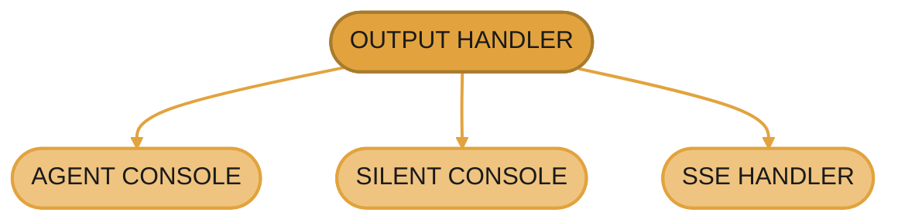

<Info>
  **Source Code:** [`src/gaia/agents/base/console.py`](https://github.com/amd/gaia/blob/main/src/gaia/agents/base/console.py)
</Info>

<Note>
**Component:** OutputHandler, AgentConsole, SilentConsole, SSEOutputHandler
**Module:** `gaia.agents.base.console`, `gaia.api.sse_handler`
**Import:** `from gaia.agents.base.console import OutputHandler, AgentConsole, SilentConsole`
</Note>
---

## Overview

The console output system provides a unified interface for handling agent output across different contexts (CLI, testing, API). It implements a modular design where agents report progress through an abstract `OutputHandler` interface, and different implementations handle the output appropriately for their context.

**Key Features:**
- Abstract interface for agent output
- Rich terminal formatting (when available)
- Silent mode for testing
- Server-Sent Events (SSE) for API streaming
- Progress indicators and file preview
- Consistent output format across all agents

---

## Architecture



| Component | Type | Purpose |
|-----------|------|---------|
| **OUTPUT HANDLER** | Abstract Base Class | Defines interface for all output handlers |
| **AGENT CONSOLE** | Implementation | Rich CLI output with colors, spinners, syntax highlighting |
| **SILENT CONSOLE** | Implementation | Suppressed output for testing and API mode |
| **SSE HANDLER** | Implementation | Server-Sent Events streaming for API clients |

**Design Philosophy:**
- Agents call output methods without knowing the implementation
- Output handlers decide HOW to display information
- Enables testing without modifying agent code
- Supports real-time streaming to API clients

---

## API Specification

### OutputHandler (Abstract Base Class)

```python
from abc import ABC, abstractmethod
from typing import Any, Dict, List, Optional

class OutputHandler(ABC):
    """
    Abstract base class for handling agent output.

    Defines the minimal interface that agents use to report their progress.
    Each implementation handles the output differently:
    - AgentConsole: Rich console output for CLI
    - SilentConsole: Suppressed output for testing
    - SSEOutputHandler: Server-Sent Events for API streaming
    """

    # === Core Progress/State Methods (Required) ===

    @abstractmethod
    def print_processing_start(self, query: str, max_steps: int, model_id: str = None):
        """Print processing start message (optionally showing the active model_id)."""
        ...

    @abstractmethod
    def print_step_header(self, step_num: int, step_limit: int):
        """Print step header."""
        ...

    @abstractmethod
    def print_state_info(self, state_message: str):
        """Print current execution state."""
        ...

    @abstractmethod
    def print_thought(self, thought: str):
        """Print agent's reasoning/thought."""
        ...

    @abstractmethod
    def print_goal(self, goal: str):
        """Print agent's current goal."""
        ...

    @abstractmethod
    def print_plan(self, plan: List[Any], current_step: int = None):
        """Print agent's plan with optional current step highlight."""
        ...

    # === Tool Execution Methods (Required) ===

    @abstractmethod
    def print_tool_usage(self, tool_name: str):
        """Print tool being called."""
        ...

    @abstractmethod
    def print_tool_complete(self):
        """Print tool completion."""
        ...

    @abstractmethod
    def pretty_print_json(self, data: Dict[str, Any], title: str = None):
        """Print JSON data (tool args/results)."""
        ...

    # === Status Messages (Required) ===

    @abstractmethod
    def print_error(self, error_message: str):
        """Print error message."""
        ...

    @abstractmethod
    def print_warning(self, warning_message: str):
        """Print warning message."""
        ...

    @abstractmethod
    def print_info(self, message: str):
        """Print informational message."""
        ...

    # === Progress Indicators (Required) ===

    @abstractmethod
    def start_progress(self, message: str):
        """Start progress indicator."""
        ...

    @abstractmethod
    def stop_progress(self):
        """Stop progress indicator."""
        ...

    # === Completion Methods (Required) ===

    @abstractmethod
    def print_final_answer(
        self,
        answer: str,
        total_tokens: Optional[int] = None,
        ttft_seconds: Optional[float] = None,
        tok_per_s: Optional[float] = None,
    ):
        """Print final answer/result.

        total_tokens: real output-token count generated across the run, if
        known. ttft_seconds: real time-to-first-token for the LLM call that
        produced this answer, if known. tok_per_s: the backend's own
        generation rate for this turn, if it reported one — never derived
        from the turn's wall clock, which includes tool time. All None when
        no real value is available — never a substituted estimate.
        """
        ...

    @abstractmethod
    def print_repeated_tool_warning(self):
        """Print warning about repeated tool calls (loop detection)."""
        ...

    @abstractmethod
    def print_completion(self, steps_taken: int, steps_limit: int):
        """Print completion summary."""
        ...

    @abstractmethod
    def print_step_paused(self, description: str):
        """Print step paused message."""
        ...

    @abstractmethod
    def print_command_executing(self, command: str):
        """Print command executing message."""
        ...

    @abstractmethod
    def print_agent_selected(self, agent_name: str, language: str, project_type: str):
        """Print agent selected message."""
        ...

    # === Optional Methods (with default no-op implementations) ===

    def print_prompt(self, prompt: str, title: str = "Prompt"):
        """Print prompt (for debugging). Optional - default no-op."""
        ...

    def print_response(self, response: str, title: str = "Response"):
        """Print response (for debugging). Optional - default no-op."""
        ...

    def print_streaming_text(self, text_chunk: str, end_of_stream: bool = False):
        """Print streaming text. Optional - default no-op."""
        ...

    def display_stats(self, stats: Dict[str, Any]):
        """Display performance statistics. Optional - default no-op."""
        ...

    # === Confirmation of gated tools (#2210) ===

    auto_approve_gated_tools: bool = False   # explicit unattended opt-in

    def confirm_tool_execution(self, tool_name: str, tool_args: Dict[str, Any]) -> bool:
        """Approve or deny a tool in ``Agent.confirmation_required_tools()``.

        DENIES by default: a handler with no way to reach a human must not answer
        on their behalf. Overridden by the CLI consoles (terminal prompt) and the
        Agent UI handler (permission modal).
        """
        ...

    def confirmation_denied_reason(self, tool_name: str) -> str:
        """Why the last denial happened, for the ``{"status": "denied"}`` result."""
        ...
```

<Warning>
  A handler that inherits this default and cannot ask anyone will refuse every
  gated tool. That is deliberate — silently approving shell commands, file writes,
  and email sends is the failure mode this replaced. An intentionally unattended
  host opts in with `auto_approve_gated_tools=True` or
  `GAIA_AUTO_APPROVE_TOOLS=1` (read from the startup environment, so a `.env`
  cannot set it), and every approval taken that way is logged.
</Warning>

### TerminalConfirmationMixin

```python
class TerminalConfirmationMixin:
    """The terminal prompt shared by both CLI consoles.

    Mixed into AgentConsole *and* SilentConsole: silence suppresses narration,
    not consent — `gaia chat` builds a SilentConsole for a real user at a real
    terminal.

    - stdin AND stdout a TTY -> shows the tool and its literal arguments, then
      reads `[y]es / [N]o / [a]lways for this tool`. Default is no; Ctrl-C and
      EOF are no. "always" is per tool and never offered for
      `run_shell_command` / `run_cli_command`.
    - otherwise -> denies with an actionable message.
    - a broken terminal (render or read fails) -> denies; the gate never raises
      into the agent loop.
    """

    def confirm_tool_execution(self, tool_name: str, tool_args: Any) -> bool: ...
    def reset_tool_approvals(self) -> None:
        """Forget every "always allow" answer (new session / new user)."""
```

### AgentConsole

```python
class AgentConsole(TerminalConfirmationMixin, OutputHandler):
    """
    Rich console output for CLI applications.

    Provides:
    - Syntax highlighting for code and JSON
    - Progress spinners
    - Live file preview during code generation
    - Colored output with emojis
    - Formatted tables for statistics
    """

    def __init__(self, auto_approve_gated_tools: bool = False):
        """Initialize the AgentConsole with Rich library support.

        Args:
            auto_approve_gated_tools: Unattended harnesses only — run
                confirmation-gated tools without asking. Every approval is logged.
        """
        self.auto_approve_gated_tools = auto_approve_gated_tools
        self.rich_available = RICH_AVAILABLE
        self.console = Console() if self.rich_available else None
        self.progress = ProgressIndicator()
        self.streaming_buffer = ""

    def print(self, *args, **kwargs):
        """
        Print method that delegates to Rich Console or standard print.

        Allows code to call console.print() directly on AgentConsole instances.
        """
        ...

    # File Preview Methods (Code Agent specific)

    def start_file_preview(
        self,
        filename: str,
        max_lines: int = 15,
        title_prefix: str = "📄"
    ) -> None:
        """Start a live streaming file preview window."""
        ...

    def update_file_preview(self, content_chunk: str) -> None:
        """Update the live file preview with new content."""
        ...

    def stop_file_preview(self) -> None:
        """Stop the live file preview and show final summary."""
        ...

    # Additional Display Methods

    def print_diff(self, diff: str, filename: str) -> None:
        """Print a code diff with syntax highlighting."""
        ...

    def print_checklist(self, items: List[Any], current_idx: int) -> None:
        """Print checklist with current item highlighted."""
        ...

    def get_streaming_buffer(self) -> str:
        """Get accumulated streaming text and reset buffer."""
        ...
```

### SilentConsole

```python
class SilentConsole(TerminalConfirmationMixin, OutputHandler):
    """
    Silent console that suppresses all output for JSON-only mode.

    Used for:
    - Unit testing (no visual noise)
    - API mode (only structured output)
    - Automated workflows

    All methods are no-ops except:
    - print_final_answer (unless silence_final_answer=True)
    - display_stats (if explicitly requested)
    - confirm_tool_execution (still prompts on a terminal — consent is not
      narration; the unattended denial notice is logged, not printed, so
      JSON-only output stays parseable)
    """

    def __init__(
        self,
        silence_final_answer: bool = False,
        auto_approve_gated_tools: bool = False,
    ):
        """
        Initialize the silent console.

        Args:
            silence_final_answer: If True, suppress even the final answer
            auto_approve_gated_tools: Unattended harnesses only — run
                confirmation-gated tools without asking. Every approval is logged.
        """
        self.streaming_buffer = ""
        self.silence_final_answer = silence_final_answer
        self.auto_approve_gated_tools = auto_approve_gated_tools

    def print_final_answer(
        self,
        answer: str,
        streaming: bool = True,
        total_tokens: Optional[int] = None,
        ttft_seconds: Optional[float] = None,
        tok_per_s: Optional[float] = None,
    ) -> None:
        """
        Print the final answer.
        Only suppressed if silence_final_answer is True.
        """
        if self.silence_final_answer:
            return
        print(f"\n🧠 gaia: {answer}")

    def display_stats(self, stats: Dict[str, Any]) -> None:
        """
        Display stats even in silent mode (since explicitly requested).
        Uses the same Rich table format as AgentConsole.
        """
        ...

    # All other methods are no-ops
```

### SSEOutputHandler

```python
from collections import deque

class SSEOutputHandler(OutputHandler):
    """
    Output handler for Server-Sent Events (SSE) streaming to API clients.

    Formats agent outputs as SSE-compatible JSON chunks that can be
    streamed to API clients (e.g., VSCode extension).

    Each output is converted to a dictionary and added to a queue
    that can be consumed by the API server.
    """

    # Denies outright rather than waiting for a user decision.
    blocking_confirmation: bool = False

    def __init__(self, debug_mode: bool = False):
        """
        Initialize the SSE output handler.

        Args:
            debug_mode: Enable verbose event streaming for debugging
        """
        self.queue = deque()
        self.streaming_buffer = ""
        self.debug_mode = debug_mode
        self.current_step = 0
        self.total_steps = 0

    def confirm_tool_execution(self, tool_name, tool_args) -> bool:
        """Deny confirmation-gated tools — the API has no approval channel.

        The base handler already fails closed; this override emits a
        ``tool_confirm_denied`` event naming the tool, why it was refused, and
        to use the Agent UI instead, so the reason reaches the caller. Returns
        True only under the shared GAIA_AUTO_APPROVE_TOOLS opt-in.
        """
        if self.auto_approve_confirmations_enabled():
            self.log_auto_approval(tool_name)
            self._add_event("warning", {"message": "Auto-approved without review"})
            return True
        self._add_event("tool_confirm_denied", {"tool": tool_name, "message": "..."})
        return self.deny_tool_execution(tool_name, "...")

    def _add_event(self, event_type: str, data: Dict[str, Any]):
        """Add an event to the output queue."""
        self.queue.append({
            "type": event_type,
            "data": data,
            "timestamp": time.time()
        })

    def should_stream_as_content(self, event_type: str) -> bool:
        """
        Determine if an event should be streamed as content to the client.

        In normal mode: Only stream key status updates and final answers
        In debug mode: Stream all events
        """
        ...

    def get_events(self) -> List[Dict[str, Any]]:
        """Get all queued events and clear the queue."""
        events = list(self.queue)
        self.queue.clear()
        return events

    def has_events(self) -> bool:
        """Check if there are any queued events."""
        return len(self.queue) > 0

    def format_event_as_content(self, event: Dict[str, Any]) -> str:
        """
        Format an event as clean content text for streaming.

        Sends clean, minimal text that is OpenAI-compatible.
        The VSCode extension will add formatting (emojis, separators) for display.
        """
        ...

    def print(self, *args, **_kwargs):
        """
        Handle generic print() calls - queue as message event.

        Captures print() calls from agent code and queues them
        as SSE events so they can be streamed to the client.
        """
        message = " ".join(str(arg) for arg in args)
        if message.strip():
            self._add_event("message", {"text": message})
```

---

## Usage Examples

### Example 1: CLI Agent with Rich Output

```python
from gaia.agents.base.console import AgentConsole
from gaia.agents.base.agent import Agent

class MyAgent(Agent):
    def _create_console(self):
        return AgentConsole()

    def process_query(self, query: str):
        # Agent reports progress through console
        self.console.print_processing_start(query, max_steps=10)
        self.console.print_step_header(1, 10)
        self.console.print_thought("Analyzing the request...")

        # Execute tools
        self.console.print_tool_usage("search_files")
        result = {"files": ["main.py", "test.py"]}
        self.console.pretty_print_json(result, title="Search Results")
        self.console.print_tool_complete()

        # Show final answer
        self.console.print_final_answer("Task completed successfully!")
        self.console.print_completion(steps_taken=1, steps_limit=10)
```

### Example 2: Testing with Silent Console

```python
from gaia.agents.base.console import SilentConsole

def test_agent_execution():
    """Test agent without console noise."""
    agent = MyAgent(silent_mode=True)

    # All agent output is suppressed
    result = agent.process_query("test query")

    # Only structured result is returned
    assert result["status"] == "success"
```

### Example 3: API Streaming with SSE

```python
from gaia.api.sse_handler import SSEOutputHandler

def stream_agent_execution(query: str):
    """Stream agent execution to API client."""
    sse_handler = SSEOutputHandler(debug_mode=False)
    agent = MyAgent(output_handler=sse_handler)

    # Execute agent in background
    import threading
    thread = threading.Thread(target=agent.process_query, args=(query,))
    thread.start()

    # Stream events as they arrive
    while thread.is_alive() or sse_handler.has_events():
        events = sse_handler.get_events()
        for event in events:
            # Format for SSE streaming
            if sse_handler.should_stream_as_content(event["type"]):
                content = sse_handler.format_event_as_content(event)
                yield f"data: {content}\n\n"
        time.sleep(0.1)
```

---

## Testing Requirements

### Unit Tests

**File:** `tests/agents/test_console.py`

```python
import pytest
from gaia.agents.base.console import AgentConsole, SilentConsole, OutputHandler

def test_output_handler_is_abstract():
    """Verify OutputHandler cannot be instantiated."""
    with pytest.raises(TypeError):
        OutputHandler()

def test_agent_console_creation():
    """Test AgentConsole initialization."""
    console = AgentConsole()
    assert console is not None
    assert hasattr(console, 'console')
    assert hasattr(console, 'progress')

def test_silent_console_suppresses_output(capsys):
    """Test SilentConsole suppresses output."""
    console = SilentConsole(silence_final_answer=True)

    # All methods should be no-ops
    console.print_processing_start("query", 10)
    console.print_thought("thinking...")
    console.print_tool_usage("search")
    console.print_final_answer("answer")

    # No output should be captured
    captured = capsys.readouterr()
    assert captured.out == ""

def test_silent_console_shows_final_answer(capsys):
    """Test SilentConsole shows final answer when not silenced."""
    console = SilentConsole(silence_final_answer=False)

    console.print_final_answer("The answer is 42")

    captured = capsys.readouterr()
    assert "42" in captured.out

def test_sse_handler_queues_events():
    """Test SSEOutputHandler queues events."""
    from gaia.api.sse_handler import SSEOutputHandler

    handler = SSEOutputHandler()

    handler.print_processing_start("test query", 5)
    handler.print_tool_usage("search")
    handler.print_final_answer("done")

    events = handler.get_events()
    assert len(events) == 3
    assert events[0]["type"] == "processing_start"
    assert events[1]["type"] == "tool_usage"
    assert events[2]["type"] == "final_answer"

def test_sse_handler_formats_content():
    """Test SSE content formatting."""
    from gaia.api.sse_handler import SSEOutputHandler

    handler = SSEOutputHandler(debug_mode=False)

    event = {
        "type": "final_answer",
        "data": {"answer": "Task completed"},
        "timestamp": 1234567890
    }

    content = handler.format_event_as_content(event)
    assert "Task completed" in content
    assert content.endswith("\n")
```

---

## Dependencies

### Required Packages

```toml
# pyproject.toml
[project]
dependencies = [
    "rich>=13.0",  # For AgentConsole formatting
]
```

### Import Dependencies

```python
import json
import threading
import time
from abc import ABC, abstractmethod
from typing import Any, Dict, List, Optional
from collections import deque

# Rich library (optional - graceful fallback)
try:
    from rich import print as rprint
    from rich.console import Console
    from rich.live import Live
    from rich.panel import Panel
    from rich.spinner import Spinner
    from rich.syntax import Syntax
    from rich.table import Table
    RICH_AVAILABLE = True
except ImportError:
    RICH_AVAILABLE = False
```

---

## Integration Points

### Agent Base Class

```python
class Agent:
    def __init__(self, output_handler: Optional[OutputHandler] = None, **kwargs):
        """Initialize agent with output handler."""
        if output_handler:
            self.console = output_handler
        else:
            self.console = self._create_console()

    def _create_console(self) -> OutputHandler:
        """Create appropriate console based on mode."""
        if self.silent_mode:
            return SilentConsole()
        return AgentConsole()
```

### API Server Integration

```python
# In API server endpoint
@app.post("/api/v1/agent/execute")
async def execute_agent(request: AgentRequest):
    sse_handler = SSEOutputHandler()
    agent = Agent(output_handler=sse_handler)

    # Execute and stream
    async def event_generator():
        # Run agent in background
        thread = threading.Thread(
            target=agent.process_query,
            args=(request.query,)
        )
        thread.start()

        # Stream events
        while thread.is_alive() or sse_handler.has_events():
            for event in sse_handler.get_events():
                yield format_sse(event)
            await asyncio.sleep(0.1)

    return StreamingResponse(
        event_generator(),
        media_type="text/event-stream"
    )
```

---

*Console Output Handlers Technical Specification*

---

<small style="color: #666;">

**License**

Copyright(C) 2024-2026 Advanced Micro Devices, Inc. All rights reserved.

SPDX-License-Identifier: MIT

</small>